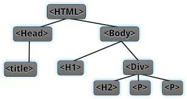

layout: true
class: center, middle, inverse
---

# Ajax 

---
layout: true
class: animated fadeInUp
---
## Agenda

(Tiempo estimado: 1h)

* Arquitectura web
  - Generalidades del protocolo HTTP
  - Métodos de petición HTTP
* Relacion cliente y servidor
  - Concepto HTML DOM
  - Lenguaje Java Script del lado del Cliente
  - Lenguaje PHP del lado del servidor
  - Framework Jquery
* Ajax 
  - Introduccion Ajax y usos
  - Librerias de terceros
  - Generacion de PDF Y codigo QR
* Comunicacion 
  - ¿Que es un api?
  - ¿Para qué necesitamos una API?
  - Provedores de APIs
  - Google API, Mercado Pago API


---

## Generalidades del protocolo HTTP

* HTTP, de sus siglas en inglés: "Hypertext Transfer Protocol", es el nombre de un protocolo el cual nos permite realizar una petición de datos y recursosl.
* Clientes y servidores se comunican intercambiando mensajes individuales
* La mayoría de las veces el agente del usuario (cliente) es un navegador Web

.pull-center[

]


---

## Elementos protocolo HTTP

* **Cliente**: el agente del usuario:Es cualquier herramienta que actué en representación del usuario, la mayor parte de los casos por un navegador Web
* **El servidor Web**: Al otro lado del canal de comunicación, está el servidor, el cual "sirve" los datos que ha pedido el cliente.
* **Proxies**: Entre el cliente y el servidor, además existen distintos dispositivos que gestionan los mensajes HTTP (caching, filtrado, autentificación) 

---

## Métodos de petición HTTP. HTTP verbs

* El método HTTP GET solicita una representación del recurso especificado. Las solicitudes que usan GET solo deben usarse para recuperar datos (no deben incluir datos).
* El método HTTP POST envía datos al servidor
* La petición HTTP PUT crea un nuevo elemento o reemplaza una representación del elemento de destino con los datos de la petición.
 
---

## Concepto HTML DOM

* El Modelo de Objetos del Documento (DOM) es una interfaz de programación de aplicaciones (API) para documentos HTML y XML
* Con el Modelo de Objetos del Documento los programadores pueden construir documentos, navegar por su estructura, y añadir, modificar o eliminar elementos y contenido.
* El objetivo es proporcionar un interfaz estándar de programación que pueda utilizarse en una amplia variedad de entornos y aplicaciones

.pull-center[

]

---

## ¿Como acceder a los elemento DOM desde Javascript?

.texto-grande[En Javascript, la forma de acceder al DOM es a través de un objeto llamado document , que representa el árbol DOM de la página o pestaña del navegador donde nos encontramos.]

```markdown
var parrafos = document.getElementsByTagName("p");
var primerParrafo = parrafos[0];

for(var i=0; i parrafos.length; i++) {
  var parrafo = parrafos[i];
}

```

El valor que se indica delante del nombre de la función (en este caso, document) es el nodo a partir del cual se realiza la búsqueda de los elementos. En este caso, como se quieren obtener todos los párrafos de la página, se utiliza el valor document como punto de partida de la búsqueda.

---

## Qué es una API

* Es una forma de describir la forma en que los programas o los sitios webs intercambian datos.
* El formato de intercambio de datos normalmente es JSON o XML.


---

## ¿Para qué necesitamos una API?

Dentro de los objetivos de las API estan:

* Ofrecer datos a aplicaciones que se ejecutan en un movil
* Ofrecer datos a otros desarrolladores con un formato más o menos estándar.
* Ofrecer datos a nuestra propia web/aplicación
* Consumir datos de otras aplicaciones o sitios Web
  
---
  
## Provedores de APIs

Algunos ejemplos de sitios web que proveen de APIS son:
    
* Twitter: acceso a datos de usuarios, estado
* Google: por ejemplo para consumir un mapa de Google
    
Pero hay muchos más: Facebook, YouTube, Amazon.

---

## Qué significa API REST

* REST significa `Representational State Transfer`
* Es un tipo de arquitectura de desarrollo web que se apoya totalmente en el estándar HTTP.
* REST se compone de una lista de reglas que se deben cumplir en el diseño de la arquitectura de una API.

Hablaremos de servicios web restful si cumplen la arquitectura REST. Restful = adjetivo, Rest = Nombre

---

## Como funciona REST

Llamadas al API:  Las llamadas al API se implementan como peticiones HTTP, en las que:

* La URL representa el recurso `http://www.formandome.es/api/cursos/1`
* El método (HTTP Verbs) representa la operación: `GET http://www.formandome.es/api/cursos/1`
* El código de estado HTTP representa el resultado: `200 OK HTTP/1.1`        `404 NOT FOUND HTTP/1.1`

---

## Creación de recursos

* La URL estará “abierta” (el recurso todavía no existe y por tanto no tiene id)
* El método debe ser POST: 

    ```markdown
    http://eventos.com/api/eventos/3/comentarios
    Respuesta a la creación de recursos
    Resultados posibles:
    403 (Acceso prohibido)
    400 (petición incorrecta, p.ej. falta un campo o su valor no es válido)
    500 (Error del lado del servidor al intentar crear el recurso, p.ej. se ha caído la BD)
    201 (Recurso creado correctamente)
   ``` 
---

## Uso de enlaces

* [Protocolos HTTP](https://developer.mozilla.org/es/docs/Web/HTTP/Overview#caracter%C3%ADsticas_clave_del_protocolo_http).
* [Web Api ](https://juanda.gitbooks.io/webapps/content/api/arquitectura-api-rest.html)
---

## Gracias!


