layout: true
class: center, middle, inverse
---

# Boostrap 5

---
layout: true
class: animated fadeInUp

---

## Agenda

(Tiempo estimado: 2h)

* Introduccion
  - Concepto `Mobile Firts`
  - Concepto Framework css
  - Para que nos sirve Boostrap CSS
  - Que nos proporciona Boostrap
  - Esta bueno boostrap, pero...
* A trabajar!!
  - Creamos el codigo inicial
  - Break point (puntos de quiebre)
  - Container y main
  - Acción responsive 

---

## Concepto Mobile Firt

- Como su traduccion lo indica «los móviles primero»
- Es un metodo de diseño de las aplicaciones movil
- Se adapta al concepto diseño responsive
- Que nuestro sitio web sea responsive no es opcional sino obligatorio


.pull-left[
   
]

.pull-left[
   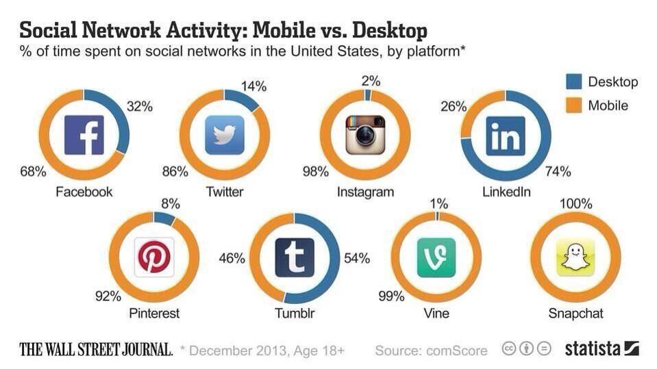
]

---

## Concepto framework css 

.texto-grande[Un framework de CSS es una biblioteca de estilos genéricos que puede ser usada para implementar diseños web.]

.texto-grande[Aportan una serie de utilidades que pueden ser aprovechadas frecuentemente en los distintos diseños web.]

---

## Que nos proporicionan

- Proporcionar una forma fácil y por tanto rápida de implementar diseños web.
- Nos aseguran que el diseño va a funcionar en una amplia gama de navegadores
- Nos aseguran que su código cumple cierta normas estándar.
- Nos aseguran cierto grado de fiabilidad en la eficacia de las utilidades que nos aportan. El framework se supone que está bien probado para asegurarnos que no hay errores.

---

## ¿Para que nos sirve boostrap css?

.texto-grande[Es una herramienta  de trabajo de desarrolladores front-end que contiene un conjunto de estilos CSS y script JS para desarrollar web con gran rapidez.]

## Que nos proporciona Boostrap

* Mobil first
* Compatibilidad con Sass
* Grid responsive 
* Componentes (navbar, card, botones, etc) [Ver componente boostrap](https://getbootstrap.com/docs/5.0/components/accordion/)
* Java plugins 

En el caso practivo vamos a utilizar estas caracteristicas para entender los fundamentes de boostrap.

---

## Esta bueno boostrap, pero....

- .texto-grande[¿Nuestro sitios van ser todos iguales?]

- .texto-grande[¿Mi CSS tendra muchas lines de codigos?]

- .texto-grande[¿Es dificil aprender boostrap CSS?]


---

## A trabajar


- Vamos a utilizar `Visual Estudio` y `Live Server`.

- Para comenzar a utilizar [Boostrap 5](https://getbootstrap.com/docs/5.0/getting-started/introduction/) solo tenemos que acceder a la documentacion oficial

.pull-center[
   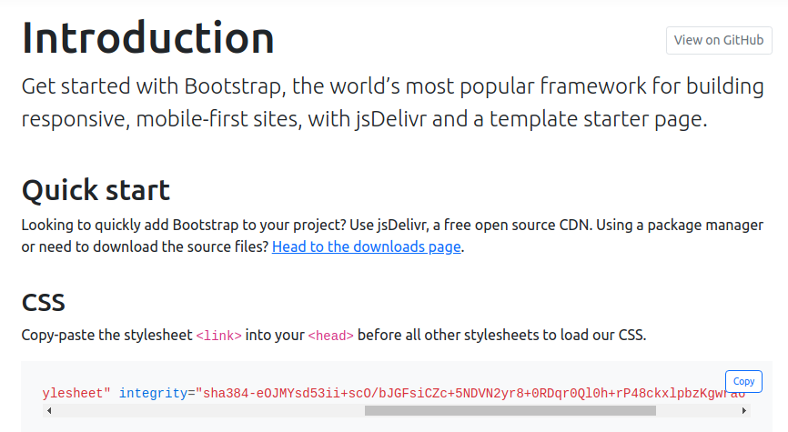
]

---

## Creamos el codigo inicial

Accedemos al [CDN](https://getbootstrap.com/docs/5.0/getting-started/introduction/#css) y sobre el header del HTML incorporamos la libreria

```markdow
<!DOCTYPE html>
<html lang="es">
<head>
    <meta charset="UTF-8">
    <meta http-equiv="X-UA-Compatible" content="IE=edge">
    <meta name="viewport" content="width=device-width, initial-scale=1.0">
    <title>Boostrap 5</title>
    <link href="https://cdn.jsdelivr.net/npm/bootstrap@5.0.0-beta3/dist/css/bootstrap.min.css" rel="stylesheet" integrity="sha384-eOJMYsd53ii+scO/  bJGFsiCZc+5NDVN2yr8+0RDqr0Ql0h+rP48ckxlpbzKgwra6" crossorigin="anonymous">
</head>
<body>
    <h1>Bienvenido a fundamentos en boostrap</h1>
</body>
</html>
```

.pull-center[
 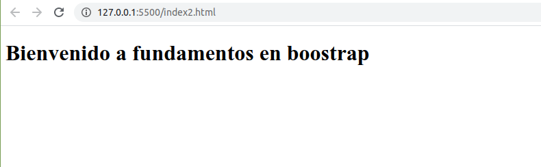
]

---

## Punto de quiebre `breakpoint`

.pull-left[
- Cuando trabajos con sitios responsive existen los llamados puntos de quiebres. [BreakPoints disponibles](https://getbootstrap.com/docs/5.0/layout/breakpoints/)

- Estos puntos de quiebres estan definidos en Boostrap como las siglas `X-Small, Small, Medium, Large, Extra large, Extra extra large`
]

.pull-right[
   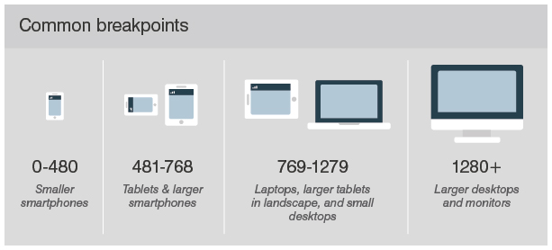
]

.texto-mediano[Los breakpoint se pueden manipular desde las clases de los compontes o traves de las llamadas `mediaqueries`]

---

## Componente `container`

Volviendo a nuestro codigo vamos a comenzar a generar el vinculo con nuestro CDN de boostrap asignando el [Containers](https://getbootstrap.com/docs/5.0/layout/containers/)

```markdown
<!DOCTYPE html>
<html lang="es">
<head>
    <meta charset="UTF-8">
    <meta http-equiv="X-UA-Compatible" content="IE=edge">
    <meta name="viewport" content="width=device-width, initial-scale=1.0">
    <title>Fundamentos Boostrap 5</title>
    <link href="https://cdn.jsdelivr.net/npm/bootstrap@5.0.0-beta3/dist/css/bootstrap.min.css" rel="stylesheet" integrity="sha384-eOJMYsd53ii+scO/  bJGFsiCZc+5NDVN2yr8+0RDqr0Ql0h+rP48ckxlpbzKgwra6" crossorigin="anonymous">
</head>
<body>
    <div class="containers">Bienvenido a fundamentos en boostrap</div>
</body>
</html>
```

Como verificamos el container es un componente de Boostrap que tiene incrustado los cambios en los breakpoints, para anular esta funcionalidad y que el containers 
se adapte al 100% de la pantalla se utiliza `container-fluid` 

---

## Acción responsive  con el componente `cotainers-fluid`

Vemos que se pueden ver centralizado el texto "Bienvenido a fundamentos en boostrap" en el caso que no quieran tener este alineamiento pueden utilizar [containers-fluid](https://getbootstrap.com/docs/5.0/layout/containers/#fluid-containers)


.pull-left[
   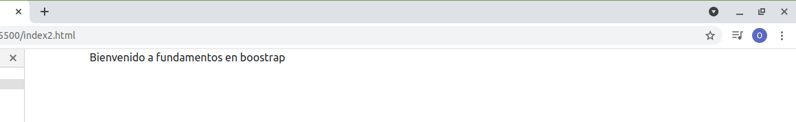
]

.pull-right[
   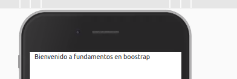
]

.texto-mediano[En este caso, la accion de cambiar de tamaño de pantalla adapta el `margen derecho del texto`, tarea que si nuestro containers llevaria varias lineas de codificación.]


---

### Grid en Boostrap

El sistema de [grid](https://getbootstrap.com/docs/5.0/layout/grid/) son un sistema poderoso de  cuadrícula de `flexbox` para dispositivos móviles para crear diseños mobile first gracias a un sistema de **12 columnas**,** 6 niveles de respuesta predeterminados**, variables `sass` y `mixins`, y docenas de clases predefinidas ([border](https://getbootstrap.com/docs/5.0/utilities/borders/), [bg color](https://getbootstrap.com/docs/5.0/utilities/colors/), [textos](https://getbootstrap.com/docs/5.0/utilities/text/), [sizing](https://getbootstrap.com/docs/5.0/utilities/sizing/), [flex](https://getbootstrap.com/docs/5.0/utilities/flex/), etc)

```markdown
<div class="container">
    <div class="row">
        <div class="col-3 border">Una de tres columnas</div>          
        <div class="col-3 border">Una de tres columnas</div>          
        <div class="col-3 border">Una de tres columnas</div> 
        <div class="col-3 border">Una de tres columnas</div>          
    </div>
</div>   
```

Tambien equivale utilizar la clase `col-sm` por la clase `col-3` al entender que una definicion del 3 como submutiplo de 12 y esto se entiende por definicion con un punto de quiebre  [ ver breakpoints disponibles](https://getbootstrap.com/docs/5.0/layout/breakpoints/#available-breakpoints)

.pull-center[
   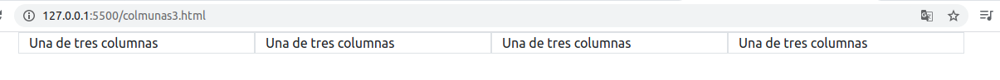
]


---

## Confección una fila con 12 columnas de 1

```markdow
<div class="container">
    <div class="row">
        <div class="col-1 border">1</div>          
        <div class="col-1 border">1</div>          
        <div class="col-1 border">1</div>          
        <div class="col-1 border">1</div>          
        <div class="col-1 border">1</div>          
        <div class="col-1 border">1</div>          
        <div class="col-1 border">1</div>          
        <div class="col-1 border">1</div>          
        <div class="col-1 border">1</div>          
        <div class="col-1 border">1</div>          
        <div class="col-1 border">1</div>
        <div class="col-1 border">1</div>
    </div>
</div>
```

.pull-center[
   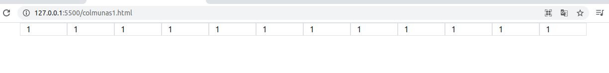
]

---

## Confeccion de una fila con 11 columnas con 10 de 1 y 1 de 2

```markdow
<div class="container">
    <div class="row">
        <div class="col-1 border">1</div>          
        <div class="col-1 border">1</div>          
        <div class="col-1 border">1</div>          
        <div class="col-1 border">1</div>          
        <div class="col-1 border">1</div>          
        <div class="col-1 border">1</div>          
        <div class="col-1 border">1</div>          
        <div class="col-1 border">1</div>          
        <div class="col-1 border">1</div>          
        <div class="col-1 border">1</div>          
        <div class="col-2 border">2</div>          
    </div>
</div>
```

.pull-center[
   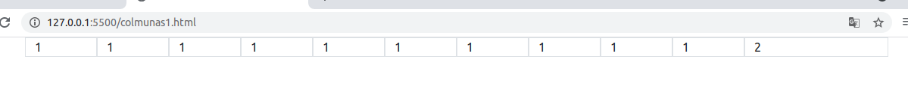
]
---
## Generando  filas con diferentes columnas

En el casos que se requieran diferentes filas con diferentes columnas puede visualizarse el siguiente caso. 

.pull-left[
   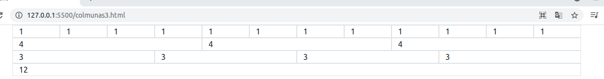
]

.pull-right[
   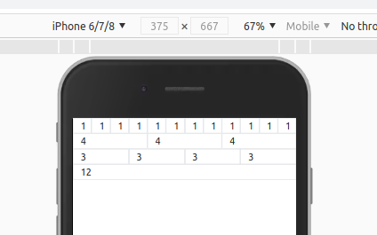
]

En este caso la ultima fila pareciera una fila pero en realidad es una columna de la tercera fila que completa sus 4 columnas de 3 mas una de 12. 

```markdow
<div class="row">
    <div class="col-3 border">3</div>
    <div class="col-3 border">3</div>
    <div class="col-3 border">3</div>
    <div class="col-3 border">3</div>
    <div class="col-12 border">12</div>
</div>
```
Este sitio **_no es responsive_** ya que se vemos que el cambio de dispositivo no responde para que las columas se desplace en toda la pantalla sin hacer una distribucion efectiva.

---

## Accion responsive en los puntos de quiebres y apellidos

Para establecer un  esquema de **_responsive_** es necesario utilizar las herramientas de utilidad mencionadas, primeros debemos entender en que momento queremos dividir las filas en columnas. Segun la [Documentación de puntos de quiebre](https://getbootstrap.com/docs/5.0/layout/breakpoints/) en este caso utilizaremos el punto de quiebre `sm` para pantallas mayores ≥576px de la siguiente manera

```markdown
 <div class="row">
     <div class="col-12 col-sm-6 border">3</div>
     <div class="col-12 col-sm-6 border">3</div>
     <div class="col-12 col-sm-6 border">3</div>
     <div class="col-12 col-sm-6 border">3</div>
     <div class="col-12 col-sm-6 border">3</div>
</div>
```

.pull-left[
   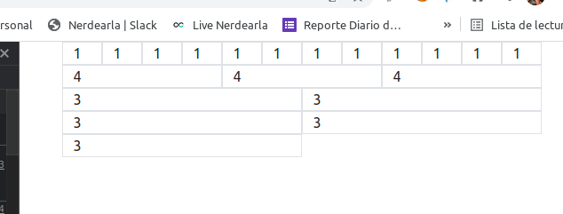
]

.pull-right[
   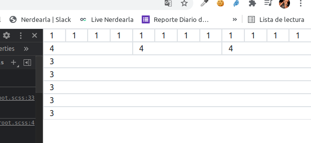
]

Efectivamente tambien podemos adaptar este sistema para que la ultima columna adapta la 12 colmunas cuando se supere los `576px` y asi tener un esquema mas versatil y asi en diferentes formas. 

---

##  Prioridad entre apellido

De acuerdo a este sistema, se expone que la herramienta adecua la posibilidad de adaptar el responsive en base a la pantalla por prioridad, en el ultimo caso todas las columnas sin apellido `col-12` dond por defecto la columna tendra una columna de 12 si no se dice lo contrario 

```markdow
<div class="row">
    <div class="col-12 col-sm-6 border">3</div>
    <div class="col-12 col-sm-6 border">3</div>
    <div class="col-12 col-sm-6 border">3</div>
    <div class="col-12 col-sm-6 border">3</div>
    <div class="col-12 border">3</div> 
</div>
```

En el caso si queremos para pantallas mayores ≥768px se podria querer dividir las fila en 3 (3 columnas 4)  se utilizara el apellido `col-md-4` llevando un lineamiento logico en el crecimiento de pantalla

```markdow
<div class="row">
    <div class="col-12 col-sm-6 col-md-4 border">3</div>
    <div class="col-12 col-sm-6 col-md-4 border">3</div>
    <div class="col-12 col-sm-6 col-md-4 border">3</div>
    <div class="col-12 col-sm-6 col-md-4 border">3</div>
    <div class="col-12 col-md-4 border">3</div> 
</div>
```
---

## Conclusion final

Por defecto la medida `sm` en la ultima columna sera 12 (por `col-12`) al no tener un apellido. Esta vez se ve que se debe adaptar a pantalla  **≥768px** por lo tanto se adaptara con col-md-6 las ultimas dos columnas.

```markdow
<div class="row">
    <div class="col-12 col-sm-6 col-md-4 border">3</div>
    <div class="col-12 col-sm-6 col-md-4 border">3</div>
    <div class="col-12 col-sm-6 col-md-4 border">3</div>
    <div class="col-12 col-sm-6 col-md-6 border">3</div>
    <div class="col-12 col-md-6 border">3</div> 
</div>
```

Al igual que en el caso de `sm` podemos omitir en la anteultima columna el apellido `col-md-6` y que tome por defecto `col-sm-6` aunque este en con  **≥768px**

.texto-mediano[¿Intentamos con `col-lg` 4 columnas de 3?]

---

## Caso practico: Vision final

Vamos a utilizar este caso para trabajar con las utilidades de boostrap 5 como `flex box`, `colors`, `sizing` entre otros.

.pull-center[
   
]

Este desafio lo pueden encontrar en [Desafio boostrap](https://www.frontendmentor.io/challenges)


---

## Planteo de problema

.texto-grande[Este esquema esta visualizando una fila con dos columnas iniciales (izquierda y derecha). Luego la columna izquierda tendra dos filas de dos columas de diferentes tamaño]

---

## Construyo las columnas

Para ellos se utilizan las clases bg-color y como mencionaba anteriormente columnas para un determinado tamaño en este esquema lg pero por defecto col-12

```markdow 
<main class="container">
    <div class="row">
    	<div class="col-12 col-lg-9 bg-primary">Lorem,....!</div>
    	<div class="col-12 col-lg-3 bg-secondary">Lorem...</div>
    </div>    
    </div> 
</main>   
```

---

## Construyo la fila dentro de la columna izquierda

De aqui sale el concepto que cuando se agrega una fila se vuelve al sistema de 12 columna aunque la fila padre este con `col-lg-9` esto nos plantea que debemos entender el sitema

```markdow
<div class="row">
<div class="col-12 col-lg-9 bg-primary">
     <div class="row">
         <div class="col-12 col-lg-8 bg-dark"><p>Lorem ...</p></div>
         <div class="col-12 col-lg-4 bg-success"><p>Lorem ...</p></div>
         <div class="col-12 col-lg-4 bg-danger"><p>Lorem ..</p></div>
         <div class="col-12 col-lg-8 bg-warning"><p>Lorem ...</p></div>
     </div>
</div>
<div class="col-12 col-lg-3 bg-secondary">Lorem ..</div>
</div>    
```
---

## Componentes en bootrap 

A este esquema le agregamos flexbox para posicionar vertical y horizontalmente nuestros elementos [Flex Box](https://getbootstrap.com/docs/5.0/utilities/flex/) usando las clases `d-flex`, `align-items-center` `justify-content-center` y `sizing` ver [Sizing](https://getbootstrap.com/docs/5.0/utilities/sizing/) usando las clases `vh-100` 

```markdow
<main class="container d-flex align-items-center justify-content-center vh-100">
```
---

## Configurando media queries

Las medias queries se utilizan hacer responsive en forma manual, creamos nuestra primera clase personalizada que es similar a `vh-100` de boostrap para mantener solo vh100 en dispositivos `lg`

```markdow
<style>
    @media (min-width: 992px) {
        .alto-100 {
        	height: 100vh;
        }   
    }   
</style>
```
---

## Fundamentos card y componentes

* Card es un componentes que se puede personalizar dentro de nuestra columnas  que pueden utilizar etiquetas de html5 como por ejemplo `article`  ver [componente cards](https://getbootstrap.com/docs/5.0/components/card/) 
* Tambien se pueden utilizar las utilidadesde los [border](https://getbootstrap.com/docs/5.0/utilities/borders/)
* Dentro de los componentes se pueden observar las siguientes clases  `m-0` (margen), `ps-3`  (padding), `h6` (tamaña de letra),  `shadow-sm` (sombra), `h-100` (alto 100), `tex-white` (color de texto) entre otros.

```markdow
<article class="card h-100 bg-primary text-white fondo-card shadow-sm">
<div class="card-body">
    <div class="d-flex mb-3">
    
    <div class="ps-3">
        <h6 class="m-0 h6">Daniel Clifford</h6>
        <p class="m-0 h6">Lorem, ipsum</p>
    </div>
    </div>
    <div>
        <p class="h6">Lorem ....</p>
        <p class="fs-6 lh-1">Lorem....</p>  
    </div>
</div>
</article>
```

---

## Instalar boostrap con npm

Se debe agregar al proyecto boostrap

`npm install bootsrap@next` o `sudo npm install --save bootstrap@next` en el caso que existan dependencias.

Luego configurar el watch en `package.json`

"scripts": {
    "test": "echo \"Error: no test specified\" && exit 1",
    "scss": "node-sass --watch  scss -o css"
  },

`npm run scss`

## Personalizar CSS  : Preprocesador CSS SASS)

.texto-mediano[Sass es un procesador CSS. Un preprocesador CSS es una herramienta que nos permite generar, de manera automática, hojas de estilo, añadiéndoles características que no tiene CSS, y que son propias de los lenguajes de programación, como pueden ser variables, funciones, selectores anidados, herencia, etcétera]

Para poder personalizar nuestras tarjetas vamos a instalar [npm](https://getbootstrap.com/docs/5.0/getting-started/download/#npm) y [SASS](https://getbootstrap.com/docs/5.0/customize/sass/#importing)

* `npm install bootstrap@next`

Luego de ejecutar la instalacion se crean los siguientes archivos

```markdow
mi-proyecto/
├── scss
│   └── custom.scss
└── node_modules/
    └── bootstrap
        ├── js
        └── scss
``` 
---

## Customizar CSS

El archivo CSS generado se customiza con SASS  desde el archivo `custom.scss`


```markdow
$font-family-sans-serif: 'Barlow Semi Condensed', sans-serif;

$primary: #733FC8;
$success: #495568;
$dark: #182020;
$secondary: #EDF2F8;

@media (min-width: 992px) { .alto-100 {height: 100vh; } }

.fondo-card {
    background-image: url('../images/bg-pattern-quotation.svg');
    background-repeat: no-repeat;
    background-position: 85% top;
}

@import "../node_modules/bootstrap/scss/bootstrap";
```
---

## Compilar SASS 

Con la ayuda de `Live Sass Compile` de visual code se compila el SASS generando el CSS final

```markdow
├── scss
│   └── custom.scss
│   └── custom.css
``` 

Se crear el archivo custom.css y ahora solo se debe incluir el css al proyecto por reemplazo del CDN

```markdow
<!DOCTYPE html>
<html lang="en">
<head>
    <meta charset="UTF-8">
    <meta http-equiv="X-UA-Compatible" content="IE=edge">
    <meta name="viewport" content="width=device-width, initial-scale=1.0">
    <title>Document</title>
     <link href="../sass/custom.css" rel="stylesheet">
</head>
```

---

## Uso de enlaces

Referencias consultadas.

* [Framework CSS](https://openwebinars.net/blog/ventajas-y-desventajas-de-usar-framework-css/)
* [Tutorial Boostrap5](https://www.youtube.com/watch?v=1kNwZbRiVcQ)
* [Documentacion Boostrap 5](https://getbootstrap.com/docs/5.0/getting-started/introduction/)
* [Correr y vigilar SASS](https://webdesign.tutsplus.com/es/tutorials/watch-and-compile-sass-in-five-quick-steps--cms-28275)

---
class: center, middle, inverse

## Gracias!


