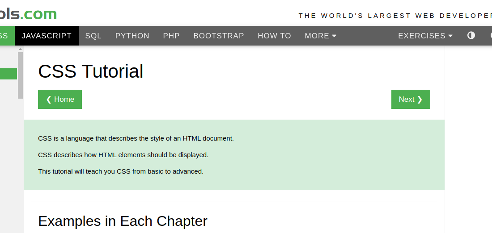

layout: true

class: center, middle, inverse
---

# CSS3 Y Html5

---
layout: true
class: animated fadeInUp
---

## Agenda

(Tiempo estimado: 3h)

* Introduccion
  - CSS 1.0 y CSS3
  - Cambio de CSS y CSS3
  - Herramienta de investigacion W3SCHOOL

  HTML5

  * Elemento `form`
  * Tipo de `input` en formulario
  * Elemento `2_canva`

* CSS3

- Selectores Avanzados
   - Selector de hijos `>` 
   - Selector adyacente `+`
   - Selector general de hermano `~`

---
## Agenda

- Pseudoclases
   - Pseudo-Clase `:first-child()`
   - Pseudo-Clase `:first-child()`
   - Pseudo-Clase `:nth-child()`
   - Pseudo-Clase `:focus()`
- Pseudo-elementos CSS
    - Pseudo-elemento `::first-letter`
    - Pseudo-elemento `::first-line`
    - Pseudo-elemento `::before y ::after`
      
---

## Agenda

- Flexbox
    - Propiedades del contenedor
        - Propiedades`flex-direction`
            - row, row-reverse, column, column-reverse
        - Propiedades `flex-wrap` 
            - `no-wrap`, `wrap`, `wrap-reverse`, 
        - Propiedades `flex-start`    
            - `flex-start`, `flex-end`, `center`, `space-around`, `space-between`
        - Propiedades `align-items` `stretch`, `flex-start`, `flex-end`, `center`, `baseline` 
    - Propiedades de los elementos
        - Propiedad `order` 
        - Propiedad `flex-grow`  
        - Propiedad `flex-shrink` 
        - Propiedad `flex-basis` 
        - Propiedad `align-self`

---

## Agenda

- Transiciones CSS
   - :hover :focus :visited :linked
- Animaciones CSS
   - Propiedad `animation`
      - `animation-name`, `animation-duration`, `animation-iteration-count`
      - `animation-delay`, `animation
   - @keyframes

---

## CSS 1.0 y CSS3

- CSS surgió inicialmente para dar un poco de orden al desorden que había a la hora de dar estilos en los distintos navegadores . Hasta que no surgió CSS, cada navegador daba estilos a las páginas web de una forma diferent

- CSS3 es modular , ya que la especificación de estilos fue creciendo tanto, que hubo que desarrollarla modularmente 

---
## Cambio de  CSS a CSS3

Evolucion CSS

.center[<iframe width="560" height="315" src="https://www.youtube.com/embed/e-71sakMLkI" frameborder="0" allow="accelerometer; autoplay; encrypted-media; gyroscope; picture-in-picture" allowfullscreen></iframe>]

---
## Herramienta de investigacion W3SCHOOL

* Se recomienda   icluir los ejercicion practivos en eun servidor apache, sin embargo puede colocar las instrucciones sobre la documentacion oficial [w3Schools](https://www.w3schools.com/css/default.asp)



---

### Input Types 

Crea una página web que contenga un formulario con los siguientes campos de información:

* **Nombre: **:  Con un control de tipo texto obligatorio y con autofoco.
* **Correo electrónico: ** Con un control de tipo email obligatorio.
* **URL:** Con un control de tipo url que muestre la ayuda "Escribe la URL de tu página web personal".
* **Fecha :** Con un control de tipo date.
* **Tiempo:** Con un control de tipo time.
* **Fecha y hora:** Con un control de tipo datetime.
* **Mes:** Con un control de tipo month.
* **Semana:** Con un control de tipo week.
* **Número:** Con un control de tipo number que limite la entrada a un valor entre -10 y 10.
* **Teléfono:** Con un control de tipo tel.
* **Término de búsqueda:** con un control de tipo search.
* **Color favorito:** Con un control de tipo color.
* **Un botón de envío**

- [Documentacion atributo type](https://www.w3schools.com/html/html_form_input_types.asp)
- [Atributo type text](http://127.0.0.1:2000/final/1_new-type/new_types.html)
- [Fomulario con input tipo text](http://127.0.0.1:2000/final/1_new-type/form_with_name.html)

---

##  2_canva

El elemento HTML `<2_canvas>`se utiliza para dibujar gráficos en una página web.

El gráfico de la izquierda se crea con `<2_canvas>`. Muestra cuatro elementos: un rectángulo rojo, un rectángulo degradado, un rectángulo multicolor y un texto multicolor.

```html
<2_canvas id="my2_canvas" width="200" height="100" style="border:1px solid #000000;">
</2_canvas>
```

```javascript
<script>
	var c = document.getElementById("my2_canvas");
	var ctx = c.getContext("2d");
	ctx.moveTo(0, 0);
	ctx.lineTo(200, 100);
	ctx.stroke();
</script>
```


- [Documentacion](https://www.w3schools.com/html/html5_2_canvas.asp)
- [2_canva basico](http://127.0.0.1:2000/final/2_canva/2_canva_basico.html) 

---

## Selectores Avanzados

### Hijo `>`
Este selector, permite seleccionar por herencia directa, es decir, que el
elemento de la derecha al signo > tiene que ser hijo directo del elemento de la
izquierda.

```css 
main > section > h2{
	color: #606bf2;
}
```
```html 
<main>
	<section>
	<h2>Selector de hijos: </h2>
	</section>
</main>
```

[Selector hijo](http://127.0.0.1:2000/final/3_selector/hijo.html)

---

## Selectores Avanzados

### Adyacente `+`
Sirve para seleccionar elementos que están dentro de un mismo
elemento contenedor y son adyacentes (contiguos ).


```css 
h2 + p {
	text-transform: uppercase;
}
```

```html 
<article>
	<h2>Selector adyacente: + </h2>
	<p>Párrafo 1</p>
	<p>Párrafo 2</p>
</article>
```

[Selector adyacente](http://127.0.0.1:2000/final/3_selector/adyacente.html)

---

## Selectores Avanzados

### Hermano `~`

Sirve para seleccionar elementos que están dentro de un mismo elemento contenedor. 
A diferencia del adyacente, no necesitan ser contiguos.

```css 
h2 ~ p {
    text-transform: uppercase;
}
```

```html 
<article>
	<h2>Elemento referencia.</h2>
	<p>Aplica estilo (elemento hermano adyacente de h2).</p>
	<p>Aplica estilo (elemento hermano NO adyacentede h2).</p>
	<h3>No aplica estilo.</h3>
</article>
```

[Selector hermano](http://127.0.0.1:2000/final/3_selector/hermano.html)

---

##  Pseudoclases

Una pseudoclase se usa para definir un estado especial de un elemento, indicando por su posicion dentro de algun conjunto de elemento DOM.

```markdown 
selector:pseudo-class {
  property: value;
}
```
[Documentación](https://www.w3schools.com/css/css_pseudo_classes.asp)

---
### Pseudoclases `first-child`

```markdown
article p:first-child {
    font-size: 120%;
    font-weight: bold;
}
```

```markdown
<article>
	<p>Aplica estilo (primer p)<p>
	<p>No aplica estilo.</p>
	<p>No aplica estilo.</p>
	<h3>No aplica estilo.</h3>
</article>
```


---
### Pseudoclases `last-child`

El `:last-childselector` coincide con todos los elementos que son el último hijo de su padre.

```markdown
article p:last-child {
    font-size: 120%;
    font-weight: bold;
}
```

```markdown
<article>
	<p>Aplica estilo (primer p)<p>
	<p>No aplica estilo.</p>
	<p>No aplica estilo.</p>
	<h3>No aplica estilo.</h3>
</article>
```
[Documentación](https://www.w3schools.com/cssref/sel_last-child.asp)
---

### Pseudoclases `nth-child(n)`

El selector coincide con cada elemento que es el `n- ésimo` hijo, independientemente del tipo, de su padre.:nth-child(n) donde n puede ser un número, una palabra clave o una fórmula.


```markdown 
span:nth-child(2){
   background-color: lime;
}
```


```markdown 
<div class="first">
  <span>Span 1!</span>
  <span>Span 2</span>
  <span>Span 3!</span>  
</div>
```

---

### Pseudoclases `nth-child(word)`

Pares e impares son palabras clave que se pueden usar para hacer coincidir elementos secundarios cuyo índice es par o impar (el índice del primer elemento secundario es 1).
Aquí, especificamos dos colores de fondo diferentes para elementos p pares e impares:


```markdown 
article p:nth-child(even){
    background-color:red;
}

article p:nth-child(odd){
    background-color: blue;
}
```


```markdown 
<article>
	<p>Aplica estilo impar<p>
	<p>Aplica estilo par<p>
	<p>Aplica estilo impar<p>
	<p>Aplica estilo par<p>
</article>
```
[Documentación](https://www.w3schools.com/cssref/sel_nth-child.asp)

---

###   Pseudoclase `:focus`
Genera el estilo en base al poner el foco en el elemento, es posible hacer desde un click


```markdown 
.red-input:focus {
  background: yellow;
  color: red;
}

.blue-input:focus {
  background: yellow;
  color: blue;
}
```


```markdown 
<article>
	<input class="red-input" value="Voy a ser de color rojo cuando enfoque."><br>
	<input class="blue-input" value="Voy a ser de color azul cuando enfoque.">
</article
```
---

###   Pseudoclase `:visited`, `:hover` y `:active`
Genera el estilo en base al poner el foco en el elemento, es posible hacer desde un click


```css 
a:link {
  color: #FF0000;
}

/* visited link */
a:visited {
  color: #00FF00;
}

/* mouse over link */
a:hover {
  color: #FF00FF;
}

/* selected link */
a:active {
  color: #0000FF;
}
```

```html 
<h2>CSS Links</h2>
<p><b><a href="default.asp" target="_blank">Este es un link</a></b></p>
<p><b>Note:</b> a:hover MUST come after a:link and a:visited in the CSS definition in order to be effective.</p>
<p><b>Note:</b> a:active MUST come after a:hover in the CSS definition in order to be effective.</p>

```

---

##  Pseudo-elemento

Un pseudoelemento CSS se utiliza para diseñar partes específicas de un elemento.

Por ejemplo, se puede utilizar para:

- Aplicar estilo a la primera letra o línea de un elemento
- Insertar contenido antes o después del contenido de un elemento

```css 
selector::pseudo-element {
	property: value;
}
```

---

###  Pseudo-elemento `::first-letter`

El ::first-letterpseudoelemento se usa para agregar un estilo especial a la primera letra de un texto.

El siguiente ejemplo formatea la primera letra del texto en todos los elementos

```css
p::first-letter {
    color: #ff0000;
    font-size: xx-large;
}
```

```html
<p>Puedes usar ::first-letter pseudo-element para agregar un efecto en el primer caracter</p>
```

---

###  Pseudo-elemento `::first-line`

El ::first-letterpseudoelemento se usa para agregar un estilo especial a la primera letra de un texto.

El siguiente ejemplo formatea la primera letra del texto en todos los elementos


```css
p::first-line {
  color: #ff0000;
  font-variant: small-caps;
}
```

```html
<p>You can use the ::first-line pseudo-element to add a special effect to the first line of a text. Some more text. And even more, and more, and more, and more, and more, and more, and more, and more, and more, and more, and more, and more.</p>

```
---

###  Pseudo-elemento `::before y ::after`

El ::before y ::after son pseudoelementos que se pueden utilizar para insertar algún contenido antes o despues del contenido de un elemento.


```css
h1::before {
  content: url(smiley.gif);
}
```

```html
<h1>This is a heading</h1>
<p>The ::before pseudo-element inserts content before the content of an element.</p>

<h1>This is a heading</h1>
```
---

## Flexbox

Antes del módulo `Flexbox Layout`, había cuatro modos de diseño:

* Bloque, para secciones de una página web
* Inline, para texto
* Tabla, para datos de tablas bidimensionales
* Posicionado, para la posición explícita de un elemento

El módulo de diseño de flexbox facilita el diseño de una estructura de diseño flexible y receptiva sin usar flotador o posicionamiento.

[Documentación](https://www.w3schools.com/css/css3_flexbox.asp)

---

### Flexbox `display:flex`

Para poder utilizar flexbox, necesitamos crear un elemento contenedor (padre) y una serie de elementos hijos `<div>`. Como el siguiente ejemplo:


```css
.flex-container {
	display: flex;
	background-color: DodgerBlue;
}
/* uso selector hijo para transmitir el estilo */
.flex-container > div {
	background-color: #f1f1f1;
	width: 100px;
	margin: 10px;
	text-align: center;
	line-height: 75px;
	font-size: 30px;
}
```


```html
<div class="flex-container">
	<div>1</div>
	<div>2</div>
	<div>4</div>
	<div>5</div>
	<div>6</div>
</div>
```

---

### Flexbox `flex-direction`

Esta propiedad establece de qué forma los elementos hijos del contenedor, se
van a posicionar `row`,`column`,`column-reverse`

```markdown 
.flex-containe{
   flex-direction: row;
}
```
[Flex Direction](http://127.0.0.1:2000/final/flexbox/flexbox_flex-direction.html)
---

### Flexbox `flex-wrap`

La propiedad flex-wrap especifica si los elementos flexibles deben ajustarse o no.

```markdown 
.flex-container{
   flex-wrap: row;
}
```
[Flex Wrap](http://127.0.0.1:2000/final/flexbox/flexbox_flex-wrap.html)
---

### Flexbox  `justify-content`

Esta propiedad establece de qué forma los elementos hijos del contenedor, se
van a posicionar.

```css 
.flex-container{
   justify-content: row;
}
```
---

### Flexbox `align-items`

Esta propiedad establece de qué forma los elementos hijos del contenedor, se
van a posicionar.

```css
.flex-container{
   align-items: row;
}
```
---

###  Elementos CSS Flex

Los elementos secundarios directos de un contenedor flexible se convierten automáticamente en elementos flexibles (flex).


```markdown
<div class="flex-container">
  <div>1</div>
  <div>2</div>
  <div>3</div>
  <div>4</div>
</div>
```
---
### Propiedad  `order`
La orderpropiedad especifica el orden de los elementos flexibles.

```markdown
<div class="flex-container">
  <div style="order: 3">1</div>
  <div style="order: 2">2</div>
  <div style="order: 4">3</div>
  <div style="order: 1">4</div>
</div>
```
---
### Propiedad `flex-grow`
La flex-growpropiedad especifica cuánto crecerá un elemento flexible en relación con el resto de los elementos flexibles.

```html
<div class="flex-container">
  <div style="flex-grow: 1">1</div>
  <div style="flex-grow: 1">2</div>
  <div style="flex-grow: 8">3</div>
</div>
```
---
### Propiedad   `flex-shrink`
La flex-shrinkpropiedad especifica cuánto se encogerá un elemento flexible en relación con el resto de los elementos flexibles.

```html
<div class="flex-container">
  <div>1</div>
  <div>2</div>
  <div style="flex-shrink: 0">3</div>
  <div>4</div>
  <div>5</div>
  <div>6</div>
  <div>7</div>
  <div>8</div>
  <div>9</div>
  <div>10</div>
</div>
```
---
### Propiedad  `flex-basis`
La propiedad `flex-basis`  especifica la longitud inicial de un elemento flexible

```markdown
<div class="flex-container">
  <div>1</div>
  <div>2</div>
  <div style="flex-basis: 200px">3</div>
  <div>4</div>
</div
```

[Documentación](https://www.w3schools.com/cssref/css3_pr_flex-basis.asp)
---
##  Transiciones 

Las transiciones permiten animar los cambios de las propiedades CSS, esta propiedad es `transition`. Para que una transición se dispare necesitamos que haya un cambio de estado en el elemento html, que puede ser  `:hover` `:focus` `:visited` `:linked`

```html
div {
  	width: 100px;
  	height: 100px;
  	background: red;
  	transition: width 2s;
}
div:hover {
  	width: 300px;
}
```

```html
<h1>Propiedad transition</h1>
<p>LLevando el curso sobre el div se activa el efecto :hover</p>
<div></div>
<p><b>Nota:</b> Este ejemplo no trabaja en version 9 Internet Explore</p>
```
- [Documentación](https://www.w3schools.com/cssref/css3_pr_transition.asp)
- [Transición basica con hover](http://127.0.0.1:2000/final/transiciones/transition.html)
---

###  Propiedad de la transiciones

La propiedades de las transciones son las siguientes:

`transition: *property duration timing-function delay*|initial|inherit;`

* `property`:  Propiedad CSS al que impacta la transicion.
* `duration`: Duracion de la en segundo o miliseguno la duracion de la transición.
* `timing-function`: Especifica la curva de velocidad del efecto de transición
* `delay`: Especifica cuándo comenzará el efecto de transición

---

### Transición disparada por el evento focus

Cuando se enfoque un `<input>`,  cambie gradualmente el ancho de 100px a 250px:

```css
input[type=text] {
  width: 100px;
  transition: width .35s ease-in-out;
}
input[type=text]:focus {
  width: 250px;
}
```

```html
<h1>Cambio propiedad width</h1>
<p>El input a 100 px. Sin embargo, cuando se hace foco se cmbia a 250 px/p>
Search: <input type="text" name="search">
```

[Transición basica con focus](http://127.0.0.1:2000/final/transiciones/transition_textbox.html)

---

## Animaciones

A diferencia de las transiciones, las animaciones, no dependen de los estados de los elementos HTML para comenzar. Pueden tener varias posiciones o cuadros claves en el movimiento, denominados `keyframes`

`animation: name duration timing-function delay iteration-count direction fill-mode play-state;`


* `animation-name`: Especifica el nombre del keyframe  que desea enlazar a la selección
* `animation-duration`: Especifica cuántos segundos o milisegundos tarda una animación en completarse
* `animation-timing-function`: Especifica la curva de velocidad de la animación
* `animation-delay`: Especifica un retraso antes de que comience la animación.
* `animation-iteration-count`: Especifica cuántas veces se debe reproducir una animación.
* `animation-direction`: Especifica si la animación debe reproducirse en reversa en ciclos alternos
* `animation-fill-mode`: Specifies what values are applied by the animation outside the time it is executing
* `animation-play-state`: Especifica qué valores aplica la animación fuera del tiempo en que se está ejecutando.
* `initial`: Establece esta propiedad en su valor predeterminado. Leer acerca de initial
* `inherit`: Hereda esta propiedad de su elemento padre. Leer sobre heredar 

[Documentación](https://www.w3schools.com/cssref/css3_pr_animation.asp)
---

### Animaciones propiedad `animation`

```css
.circulo{
    animation-name: circulo-animacion;
    animation-timing-function: ease;
    animation-duration: 1s;
    /*animation-interation-count: infinite;*/
}
@keyframes circulo-animacion {
    0% {transform: translateX(0px);}
    50% {transform: translateX(500px);}
    100% {transform: translateX(0px);}
}
</style>
```
```html
<div class="circulo">
   	<h1 class="">Animacion</h1>
</div>
```
[Animacion circular](http://127.0.0.1:2000/final/animacion/animacion_ciclo.html)

---

### Animaciones : `@keyframes`

La regla `@keyframes` especifica el código de animación.

`@keyframes *animationname* {*keyframes-selector* {*css-styles;}*}` 

* `animationname`: Define el nombre de la animación selector de keyframe  obligatorio. 
* `keyframes-selector`: Porcentaje de la duración de la animación.
    * 0-100%
    * from (mayor a 0%)
    * to (menor a 100%)
* `css-styles`:Uno o mas estilo CS

La animación se crea cambiando **gradualmente** un conjunto de estilos CSS a otro.

Durante la animación, puede cambiar el conjunto de estilos CSS muchas veces.

Se especifique cuándo ocurrirá el cambio de estilo en porcentaje, o con las palabras clave "from" y "to", que es lo mismo que 0% y 100%. 0% es el comienzo de la animación, 100% es cuando la animación está completa.

- [Documentación](https://www.w3schools.com/cssref/css3_pr_animation-keyframes.asp)
---

### Animaciones : `@keyframes`

```css
div {
  width: 100px;
  height: 100px;
  background: red;
  position: relative;
  animation: movimiento 5s 1;
  animation-delay: -2s;
}

@keyframes movimiento {
  from {left: 0px;}
  to {left: 200px;}
}
```

```html
<p>Usando valores negativos: Aquí, la animación comenzará como si ya se hubiera estado reproduciendo durante 2 segundos:</p>
<div></div>
```

- [Animacion con avance gradual de cuadro](http://127.0.0.1:2000/final/animacion/animacion_avance_cuadro.html)

---

class: center, middle, inverse

## Gracias!

