layout: true
class: center, middle, inverse
---

# Deploy: Integración y entregas continuas CI/CD .  

---
layout: true
class: animated fadeInUp
---
## Agenda

(Tiempo estimado: 1h)

* Conceptos principales
   - Concepto CI/CD
   - Devops y PaaS
   - Herramientas mas conocidas 
* Herramienta Heroku
   - ¿Que es Heroku? 
   - Git Heroku y deploy directo desde su repositorio. 
      - Proyecto `MyApp`
      - Herramienta `hgrok` y su uso para usar una base de datos local.  
   - Vincular proyecto GitHub con Heroku
* Herramientas de CI/CD
   - ¿Que son las herramientas Travis y Jenkis? 
   - Vincular GitHub + Jenkis (opensource) + Heroku (opensource)
   - Vincular GitHub + Travis (opensource) + Heroku (opensource)
* AWS Cloud
   - ¿Que es AWS Cloud y que nos ofrece? 
   - Creacion y configuracion de un `AWS Bucket` servicio `S3`
   - Vincular GitLab con `AWS Bucket`
   
---

## Conceptos principales : Concepto de CI/CD

.texto-grande[La integración y la entrega continua (CI y CD, respectivamente) encarnan una cultura, principios y prácticas que permiten a los desarrolladores de aplicaciones entregar cambios de código de manera más frecuente y fiable.]

.pull-center[
   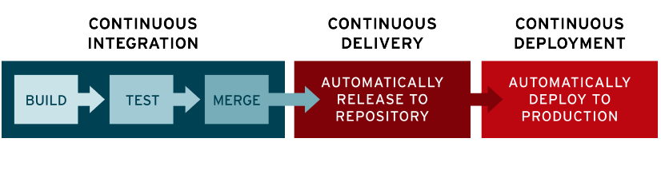
]

---

## Conceptos principales: Devops y PaaS

- DevOps es un acrónimo inglés de development (desarrollo) y operations (operaciones), que se refiere a una metodología de desarrollo de software que se centra en la comunicación, colaboración e integración entre desarrolladores de software y los profesionales de sistemas en las tecnologías de la información (IT)

- Un PaaS, como su nombre lo indica, es una tecnología de plataforma como servicio que básicamente se encarga de proporcionarnos un entorno adecuado para el despliegue y el desarrollo de aplicaciones.

.pull-center[
   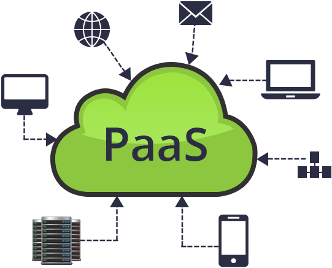
]

---

## Conceptos principales:  Herramientas mas conocidas

.pull-left[
- [Heroku](https://www.heroku.com/): Archivos, Servidores, escalamiento, etc 
- [Jenkis](https://www.jenkins.io/): Servicios CD/CI.
- [Travis](https://travis-ci.org/): Servicios CD/CI.
- [AWS CloudFormation](https://aws.amazon.com/es/): Archivos, Servidores, escalamiento, etc 
- [Google Cloud](https://cloud.google.com): Archivos, Servidores, escalamiento, etc 
- [Microsft Azure](https://azure.microsoft.com/es-es/overview/what-is-azure/): Archivos, Servidores, escalamiento, etc 
- [Always Data](https://www.alwaysdata.com) : Archivos, Servidores, escalamiento, etc 
]

.pull-right[
   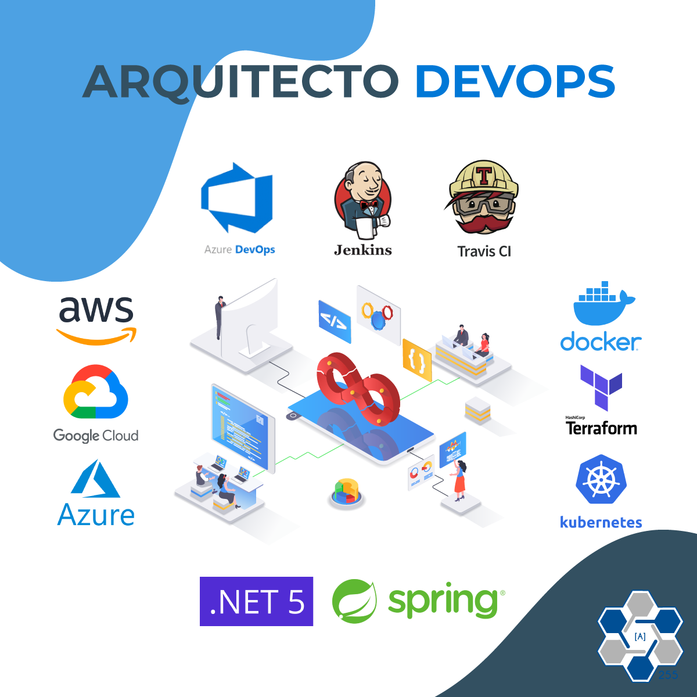
]

---

## Conceptos principales: Servicios ofrecidos

Estas plataformas ofrecen algunos de estos servicios

- Máquinas virtuales. Aplicaciones en la nube y máquinas virtuales Windows y Linux de gran capacidad.
- Aplicaciones WEB y Móvil. 
- Almacenamiento en la nube.
- Bases de datos.
- Aprendizaje automático.
- Análisis.
- Internet de las cosas.
- Redes virtuales.
- Otros...

Atención: Tener en cuenta que estos servicio puede separados se ofrecen gratis para siempre, prueba por 12 meses entre otros planes y por eso en la incripciones piden como autenticacion datos de tarjetas de creditos.

---

## Heroku:  ¿Que es Heroku?

.texto-grande[Heroku es plataforma especializada en ofrecer servicios de servidores y redes administrados en donde se pueden alojar aplicaciones de diferentes lenguajes de programación como Python, Java, PHP y más. ]

- Posee una extensa documentacion [Documentation Heroku](https://devcenter.heroku.com/categories/reference)
- Tambien contiene el cliente [Heroku CLI](https://devcenter.heroku.com/articles/heroku-cli).
- Contiene su propio repositorio Git [Deploying with Git](https://devcenter.heroku.com/articles/git#create-a-heroku-remote)

---

## Heroku: Cliente heroku 

Desde el cliente de heroku se puede ver el log del servidor hasta cambiar el tipo del servidor. 

Instalacion: 

```markdow
sudo curl https://cli-assets.heroku.com/install.sh | sh 
sudo snap install --classic heroku // Instalacion en linux
```

Algunos comandos importantes

```markdow
heroku create -a example-app // Crear una app
heroku --version  // Verifica instalacion
heroku login // Login desde la web   
heroku login -i  
heroku logs --tail --app {aplicación} // Logs de las acciones en la web
heroku buildpacks:set heroku/php --app {aplicación}  // Cambio del lenguaje a php
heroku buildpacks:set heroku/java --app {aplicación}  // Cambio del lenguaje a java
heroku buildpacks:set heroku-community/static --app {aplicación}  // Cambio a sitio estatico (html)
```

---

## Heroku: Crear app en heroku

* Para acceder a heroku debemos tener una cuenta en [Heroku](https://www.heroku.com/)
* Se accede a la herramienta y se crea un app desde `new app`

.pull-center[
   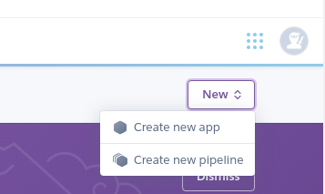
]

* Y se accede a la vista de la app 

.pull-center[
   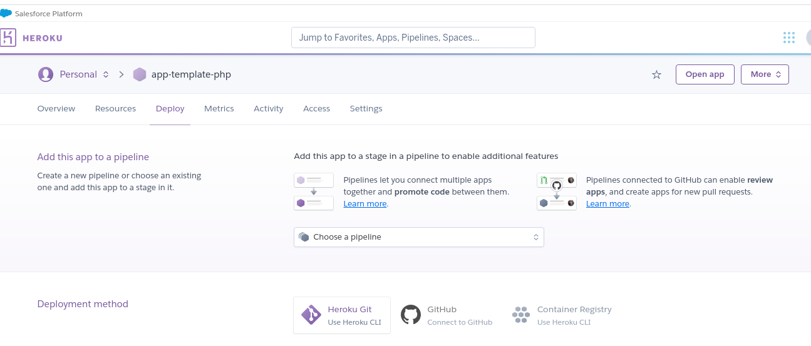
]

---

## Heroku: Iniciar repositorio remoto

Siguiendo las instrucciones puedo clonar el proyecto de la app creada
Si aún no estas logueado, inicie sesión en su cuenta de Heroku y siga las indicaciones para crear una nueva clave pública SSH

`$ heroku login`

Crear un nuevo repositorio de Git
Inicialice un repositorio de git en un directorio nuevo o existente

```
$ cd myapp/
$ git init
$ heroku git:remote -a omarhectorsosa-myapp
```
Verifico los repositorios remotos vinculados
```
git remote -v
heroku	https://git.heroku.com/omarhectorsosa-myapp.git (fetch)
heroku	https://git.heroku.com/omarhectorsosa-myapp.git (push)
origin	https://github.com/omarhectorsosa/myapp.git (fetch)
origin	https://github.com/omarhectorsosa/myapp.git (push)
```
Nota: El mismo proyecto puede estar vinculado a diferentes repositorios remotos (uno de heroku y otros de github) 
```
git remote add gitlab https://gitlab.com/omarhectorsosa/myapp
```

---

## Heroku: Iniciar repositorio remoto

Confirme su código en el repositorio e impleméntelo en Heroku usando Git.

```
$ git add .
$ git commit -am "make it better"
$ git push heroku master
```

Luego puedo verificar la actividad junto al despliegue. 

.pull-center[
   
]

---

## Conectar base de datos local con `hgrok`

Teniendo instalado `mysql` en mi maquina local genero un puente para acceder desde la web publicada.

`hgrok tcp 3306`

.pull-center[
   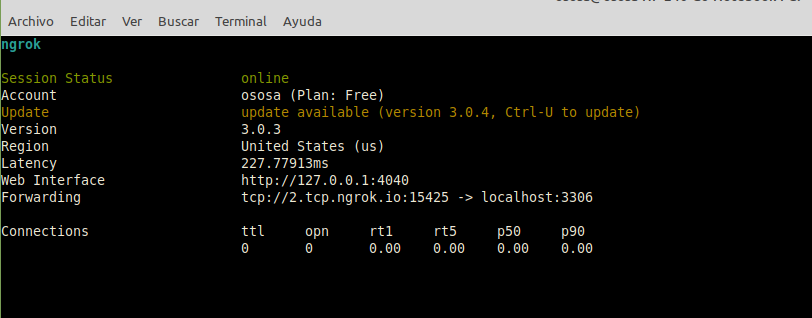
]

---

## Conectamos a la base local en el codigo en `Heroku`

Teniendo el acceso a la base de datos local accedo desde `heroku`

```markdown
<!DOCTYPE html>
<html lang="en">
<head>
    <title>My App</title>
    <link href="https://cdn.jsdelivr.net/npm/bootstrap@5.0.0-beta3/dist/css/bootstrap.min.css" rel="stylesheet" integrity="sha384-eOJMYsd53ii+scO/bJGFsiCZc+5NDVN2yr8+0RDqr0Ql0h+rP48ckxlpbzKgwra6" crossorigin="anonymous">
</head>
<body>
<main clas="container">
<div class="row text-center bg-success mb-10"><div class="col-12">Tabla.</div></div>  
<?php
    if (!($conexion=mysqli_connect("4.tcp.ngrok.io:17069","root","password","almacen"))) {
        echo 'Error conectando a la base de datos' ;   
    } else {
        $res = mysqli_query($conexion,"SELECT * FROM product") or die(mysqli_error($conexion)); ;
        while($reg = mysqli_fetch_array($res)){
            echo '<div class="row text-center b-10 boder-secondary border-radius border-5"><div class="col-3 bg-primary border boder-secondary  border-2">'.$reg["id"].'</div>';
            echo '<div class="col-3 bg-primary border boder-secondary  border-2">'.$reg["name"].'</div>';
            echo '<div class="col-3 bg-primary border boder-secondary  border-2">'.$reg["price"].'</div>';
            echo '<div class="col-3 bg-primary border boder-secondary  border-2">'.$reg["description"].'</div></div>';
        }
    }

?>
</body>
</html>
```
---

## Heroku: Vincular proyecto GitHub con Heroku

.texto-grande[Ya tenemos nuestro repositorio en `GitHub` y nuestra App en `Heroku`]

* Debemos implementas estas herramientas CD para poder hacer entregas continuas automatizadas. 
* Conectar nuestro repositorio de **GitHub** con nuestro app en **Heroku**
* Desde Heroku nos ubicamos en la seccion de implementacion **Deploy**

.pull-center[
   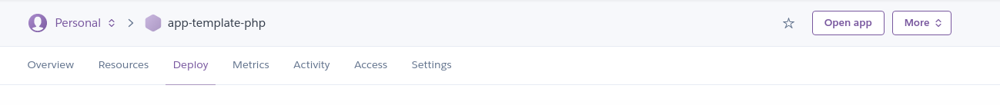
]

---

## Heroku: Vincular proyecto GitHub con Heroku

* Selecciono [GitHub](https://github.com/) como sistema de repositorio (conectado con mi usuario)

.pull-center[
   
]

* Busco y conecto el repositorio de **GitHub**

.pull-center[
   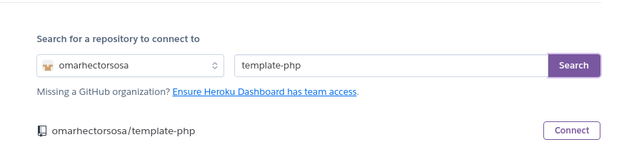
]

---

## Heroku: Vincular proyecto GitHub con Heroku

Una vez que nos autentiquemos en `GitHub` y asignemos el proyecto tenemos que realizar los siguientes tareas:

1. `Vincular rama especifica`: Por defecto suele ser master, en tanto debemos entender que todo cambio en master deberia ser un "acto"  de deploy en produccion.
1. `Activar deploy automatico`: Esto no se activa automaticamente cada que vez que se sube un cambio en la rama indicada

.pull-center[
   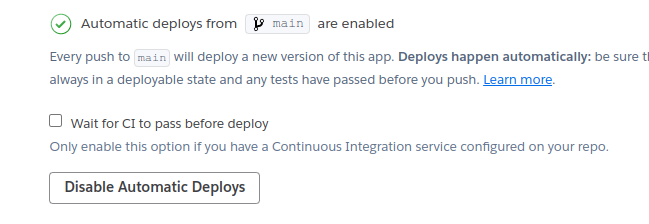
]

---

## Heroku: Vincular proyecto GitHub con Heroku 

Al generar el push se debe acceder a heroku y ejecutar el deploy

.pull-left[
* Desde la cuenta de heroku reviso la actividad de la aplicacion y reviso el `build log`.
* Puede verificar desde el log general en `more->view log`
* Para acceder a la url se hace click en `Open app`
]

.pull-right[
   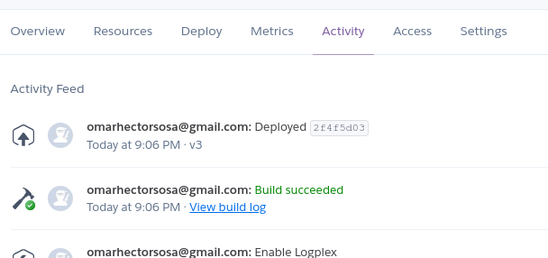
   
]

Y al final vemos el resultado accediendo al sitio 

.pull-center[
   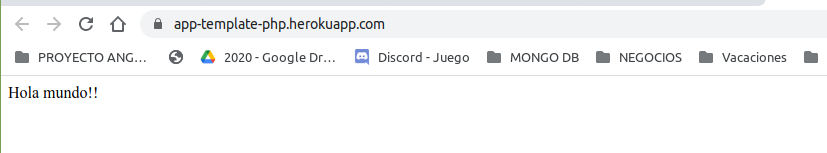
   
]

---
## Herramientas de CI/CD: ¿Que son las herramientas Travis y Jenkis? 

- Jenkins Travis son un servidor open source para la integración continua. 
- Son herramientas que se utilizan para compilar y probar proyectos de software de forma continua.
- Facilita a los desarrolladores integrar cambios en un proyecto y entregar nuevas versiones a los usuarios

.pull-left[
   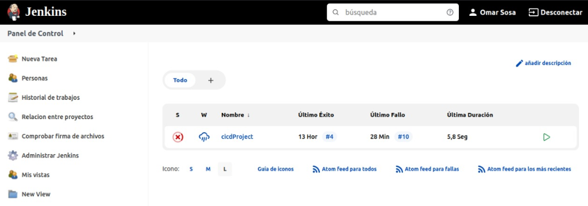
]

.pull-right[
   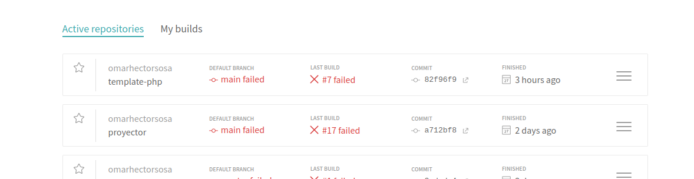
]

---

# Vincular GitHub + Jenkis (opensource) + Heroku (opensource)

Comienzo la instalación de jenkis en nuestra maquina local

`wget -q -O - https://pkg.jenkins.io/debian-stable/jenkins.io.key | sudo apt-key add -`
`sudo sh -c 'echo deb https://pkg.jenkins.io/debian-stable binary/ > /etc/apt/sources.list.d/jenkins.list'`
`sudo apt-get install jenkis`

Para poder avanzar con la instalacion se debe descubir el password incial

`sudo cat /var/lib/jenkins/secrets/initialAdminPassword`

.pull-right[
   
]

---

# Vincular GitHub + Jenkis (opensource) + Heroku (opensource)

`¿Como crear una tarea en jenkis`

Dependiendo de los permisos del usuario, en el dashboard inicial aparecerá la opción “New Item“
- Nombrar la tarea acorde con la actividad
- Escoger “Freestyle project“
- Ir a “configure“

`¿Como configurar una tarea en jenkis?`
Una tarea en Jenkins de tipo “Freestyle project” se ejecuta teniendo en cuenta el siguiente flujo:
- General: Define aspectos generales del proyecto
- Source Code Management: Define dónde se encuentra el proyecto (CVS, Git, etc)
- Build Triggers: Define qué acción va a hacer que el proyecto que estamos creando se ejecute
- Build Environment: Define el entorno en el que se ejecutará la tarea
- Build: Define qué acciones realizar al momento de realizar la ejecución de la tarea, por ejemplo, ejecutar un comando en una linea de comandos
- Post-build Actions: Define acciones posteriores a la ejecución de la tarea
Para el ejemplo crearemos un flujo configurando algunos aspectos a manera de ejemplo.

---

# Vincular GitHub + Jenkis (opensource) + Heroku (opensource)

`¿Como configurar los respositorios?`

* Repositorio 1:
   - Repository URL: url donde se encuentra el código (github, bitbucket, gitlab, etc)
   - Credentials: Credenciales para el ingreso a este repositorio
* Repositorio 2:
   - Repository URL: url del repositorio en heroku
   - Credentials: Credenciales para el ingreso a este repositorio

.pull-center[
   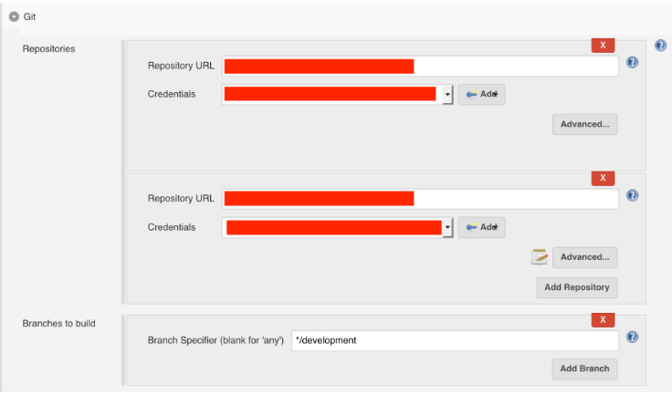
]

Notas:
En nuestro caso tendremos que agregar otro repositorio ya que descargaremos el código de un origen y lo subieremos a otro (heroku), no olvidar añadir el nombre de este nuevo origen.
No olvidar que si queremos que las pruebas se ejecuten en una rama en particular, debemos configurar la rama en el parámetro “branches to build”, en nuestro caso, develop

---

# Vincular GitHub + Jenkis (opensource) + Heroku (opensource)

Queremos que la tarea de Jenkins se ejecute cada vez que existe un cambio en la rama develop de nuestro repositorio, para esto seleccionamos la opción “Build when a change is pushed to BitBucket”

.pull-center[
   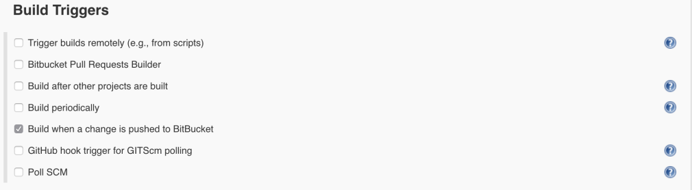
]

---

# Vincular GitHub + Jenkis (opensource) + Heroku (opensource)

Después de ejecutar las pruebas queremos que se realice el despliegue automático de nuestra aplicación en Heroku, ya que para hacer el despliegue en Heroku tan solo es necesario realizar push a la rama master del proyecto, debemos:

- Añadir la acción “Git Publisher” en la opción “Add post-build action“
- Habilitar las siguientes opciones:
- Push Only If Build Succeeds: Esto permitirá que se realice el push siempre y cuando las acciones anteriores hayan sido exitosas
- Añadiremos un branch con el botón “Add Branch“
- En “branch to push” configuraremos el nombre de la rama donde queremos hacer el push, master
- En “target remote name” configuraremos el nombre del repositorio remoto, heroku

.pull-center[
   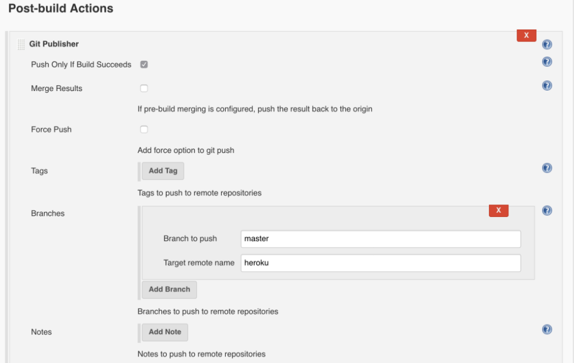
]

---

## Vincular GitHub + Jenkis (opensource) + Heroku (opensource)

Crear las llaves desde el local para github y heroku

`ssh-keygen -t rsa`

Esto generar el archivo `id_rsa` en la carpeta `.ssh` copia su contenido en la llave creada en GitHub. 

.pull-left[
   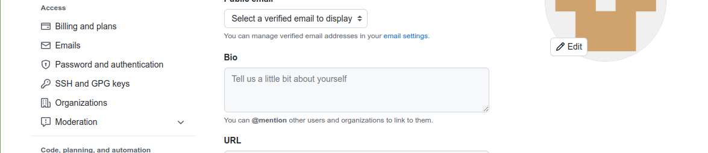
]

.pull-right[
   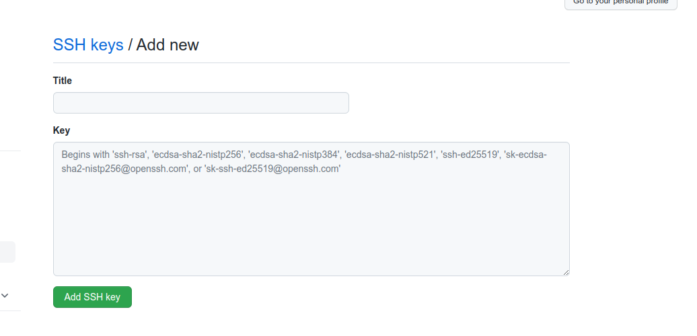
]
---


## Vincular GitHub + Jenkis (opensource) + Heroku (opensource)

Comenzar a configurar el accesoa los repositorios ejecutar los siguiente comando para obtener las claves de heroku: 

`ssh-keygen -t rsa`

Esto generar el archivo `id_rsa` copia su contenido para crear la llave en Jenkis. 

Luego ejecutar los siguientes comandos

`heroku keys:add`
`git push heroku`

---

## Vincular GitHub + Jenkis (opensource) + Heroku (opensource)

Creo una conexion publica de mi local

`ngrok http 8080`

Luego agrego la direccion de jenkis (ejemplo)

`{dominiogenerado}/github-webhook`

Cuando se genere el push en GitHub se verifica que ejecuta la tarea configurada.

---

## Vincular GitHub + Travis  + Heroku (opensource)

Para poder trabajar con travis se debe instalar el `Travis CLI` y seguir lso siguientes pasos. 
- Crear en archivo `.travis.yml` en el raiz del proyecto. con el siguiente contenido
```
lenguage: php
php:
  - '7.2'
deploy:
  provider: heroku
  api_key:
    secure: ""
  app: omarehectorsosa/template-php
```
- Crear la llave con herroku `travis encrypt $(heroku auth:token) --add deploy.api_key`
- La accion anterior escribira el archivo `.travis.yml` :
```
lenguage: php
php:
  - '7.2'
deploy:
  provider: heroku
  api_key:
    secure: PHPsNTCjYqMFnP...
  app: omarehectorsosa/template-php
```

---

## Vincular GitHub + Travis  + Heroku (opensource)

Se hace algun cambio en el proyecto y deberiamos tener la tarea en travis

.pull-right[
   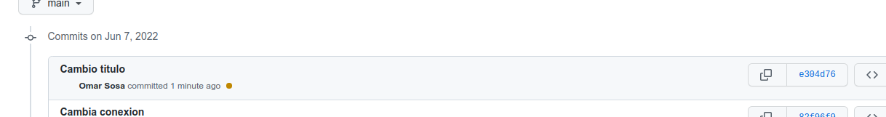
]
.pull-left[
   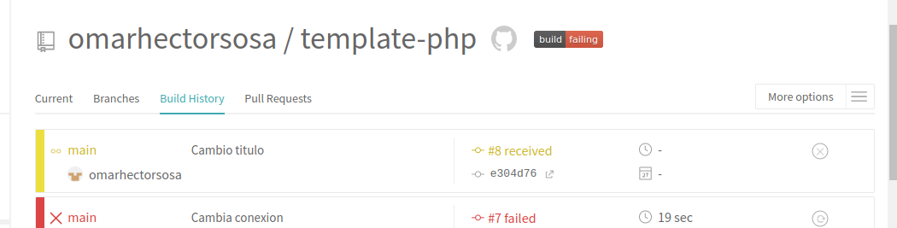
]

.pull-center[
   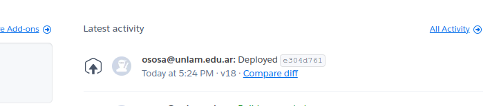
]

---

# Aws Cloud: 

.texto-grande[Un bucket es un contenedor para objetos almacenados en Amazon S3. Puede almacenar cualquier cantidad de objetos en un bucket]

.pull-center[
   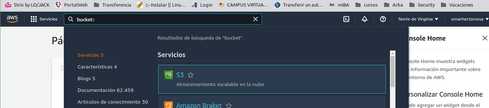
]

Aclaración: Para tener acceso a una cuenta AWS se debe realizar una sucripción gratuita pero con una tarjeta de credito como primera instancia.

---

# CI/CD con AWS y GitLab: Crear y configura un bucket

En principio debemos acceder al servicio `S3` y luego crear un bucket.

.pull-center[
   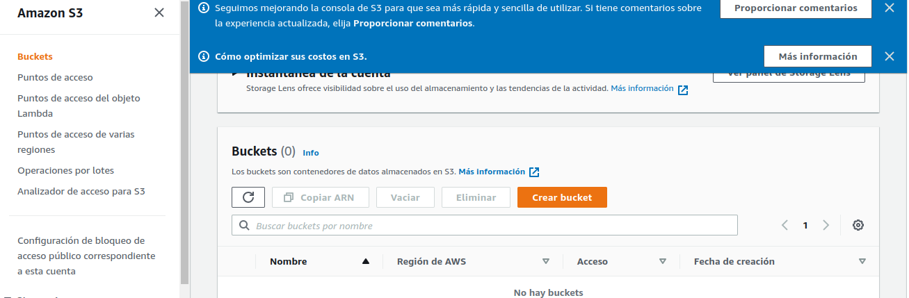
]

Configuramos el bucket.

.pull-center[
   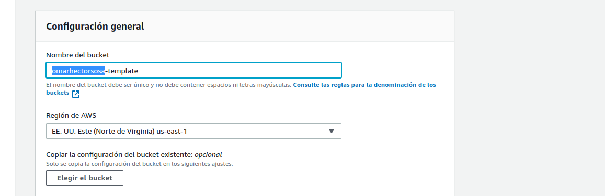
]
---

# CI/CD con AWS y GitLab: Crear y configura un bucket

Configurar el bucket para que sea publico

.pull-center[
   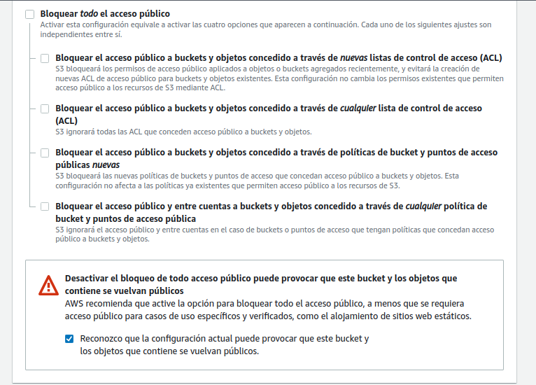
]

---

# CI/CD con AWS y GitLab: Crear y configura un bucket

Al finalizar la creacion del bucket se presenta en el listado  

.pull-center[
   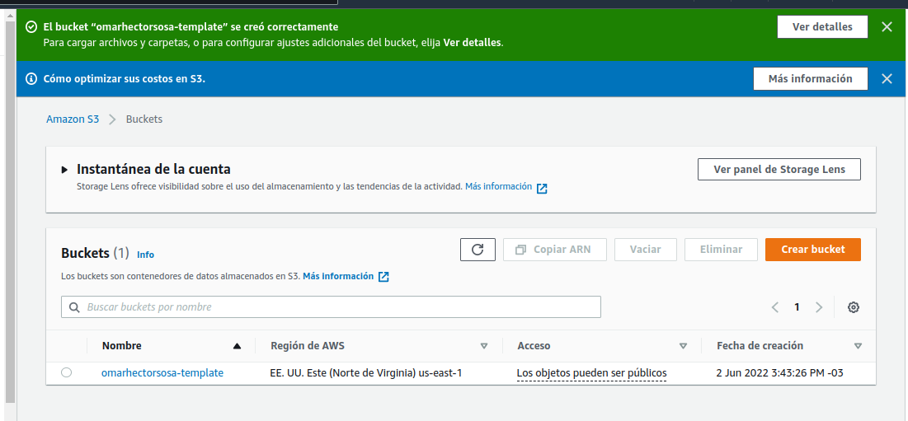
]

---

# CI/CD con AWS y GitLab: Crear y configura un bucket

Luego tenemos que agregar las politicas del `bucket` creado ingresando a la edicion de bucket en la seccion de `permisos`

.pull-center[
   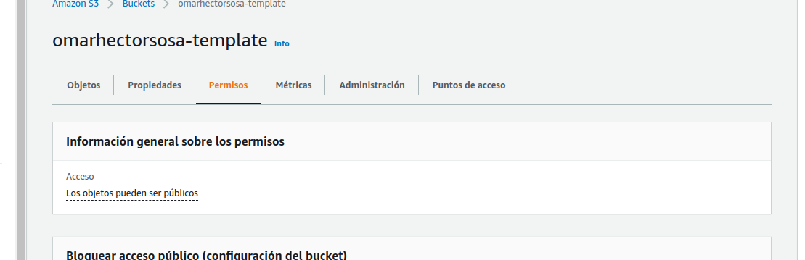
]


---

# CI/CD con AWS y GitLab: Crear y configura un bucket

Agregar las siguientes politicas de ejemplo [Ver politicas](https://docs.aws.amazon.com/AmazonS3/latest/userguide/access-policy-language-overview.html)

.pull-center[
   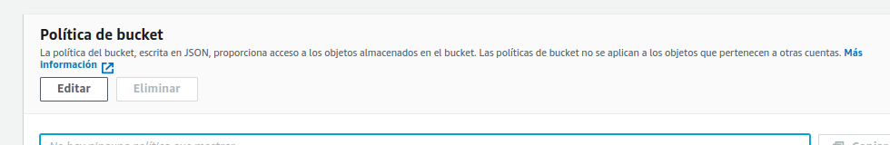
]

Tambien es posible generar una Politica desde [Generador politicas](https://awspolicygen.s3.amazonaws.com/policygen.html)

```markdow
{
  "Id": "Policy1654200096995",
  "Version": "2012-10-17",
  "Statement": [
    {
      "Sid": "Stmt1654200095421",
      "Action": [
        "s3:GetObject"
      ],
      "Effect": "Allow",
      "Resource": "arn:aws:s3:::omarhectorsosa-template/*",
      "Principal": "*"
    }
  ]
}
```

---

# CI/CD con AWS y GitLab: Crear y configura un bucket

Una vez aplicada la politica veremos que el bucket se hace publico

.pull-center[
   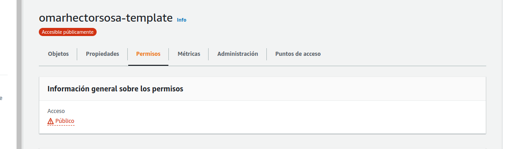
]

Viendo que el bucket esta disponible podemos cargar una imagen para verificar su disponibilidad.

---

# CI/CD con AWS y GitLab: Configurar CI/CD en GitLab

Se debe agregar las siguientes variables: 

- Configuracion de region `AWS_REGION`
- Configuración de id de accesos: `AWS_ACCESS_KEY_ID`
- Configuracion de clave secreta: `AWS_SECRET_ACCESS_KEY`
- Configuracion del bucket : `DEV_S3_BUCKET`

---

## Uso de enlaces

El sistema de enlaces es el mismo que el markdown:

* [Git](https://git-scm.com/doc).
* [Heroku](https://www.heroku.com/).
* [Tutorial](https://youtu.be/hWglK8nWh60).
* [Paas](https://www.teamnet.com.mx/blog/paas-en-la-metodolog%C3%ADa-devops)
* [Alternativas a Heroku](https://saasradar.net/mejores-alternativas-a-heroku/#AlwaysData)
* [CD/CI con AWS](https://www.youtube.com/watch?v=3RY3rBhUrE0)
* [Integracion Jenkis](https://dev.to/mariehposa/achieving-continuous-integration-and-deployment-with-jenkins-4d6k)
---
class: center, middle, inverse

## Gracias!


