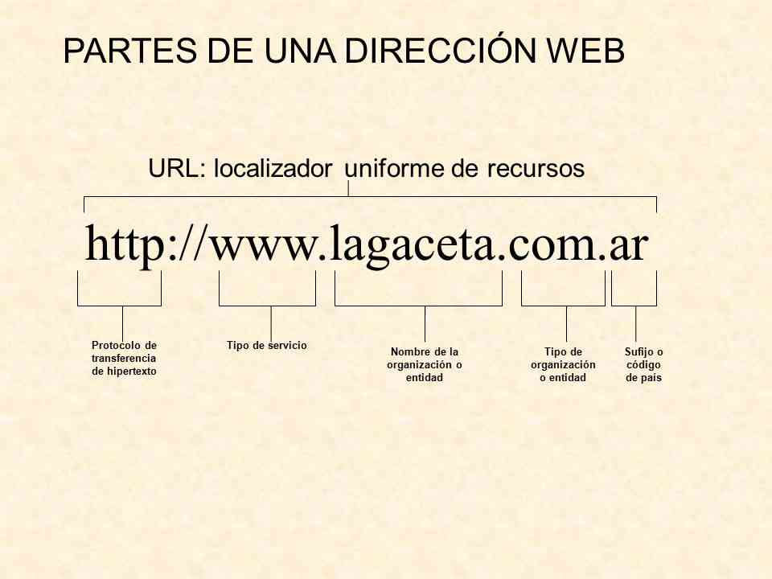

layout: true
class: center, middle, inverse
---

# Internet II

---
layout: true
class: animated fadeInUp
---
## Agenda

(Primera parte estimado: 2h)

* Redes de computadoras
  - ¿Que es una red y como funciona?
  - Clasificacion de red
    - Por topologia
    - Por tamaño
    - Intranet y extranet
* Internet: Red de redes
  - Pequeño paso por la historia de internet. 
  - Concepto de intranet y extranet
  - Manejo de intranet de la universidad. 

---

(Segunda parte estimado: 2h)

* Protocolos de comunicacion
    - Definicion de protocolo
    - Concepto de direccion IP 
    - Regla de comunicacion 
* Dominio
    - Concepto de DNS
    - Comando DOS (ifconfig y ping)
* Servicios de internet
    - ¿Que servicios nos ofrece?
    - Navegadores, Webmail, teleconferencia. ftp, etc

* Seguridad de redes
    - Virus y antivirus
    - Firewall

---

## Fundamento

.texto-grande[Una red (Net) de computadoras consiste en dos o más computadoras que pueden compartir información,
datos, recursos y servicios.]

.pull-left[
* Comunicacion fisica
* Servidores 
* Plataforma común (protocolo)
* Software de aplicaciones.
* Hardware de comunicacion
* Servicios 
]

.pull-right[
   
]
 
---

## ¿Donde se encuentras las redes y como funcionan?

.center[<iframe width="560" height="315" src="https://www.youtube.com/embed/z7Q_NRGyKt4" title="YouTube video player" frameborder="0" allow="accelerometer; autoplay; clipboard-write; encrypted-media; gyroscope; picture-in-picture" allowfullscreen></iframe>]

---

## Clasificacion de redes

.texto-grande[La clasificaciones mas comunes de las redes son por su topologia  y alcance ]

.pull-right[
   
]

.pull-right[
   
]

---

## Por alcance 

.texto-grande[En función del tamaño y del alcance de la red de ordenadores, se puede establecer una diferenciación entre diversas dimensiones de red. Entre los tipos de redes más importantes se encuentran]

.pull-left[
* Alcance 
* Personal Area Networks (PAN) o red de área personal
* Home area network (HAN) o red de area del hogar
* Local Area Networks (LAN) o red de área local
* Metropolitan Area Networks (MAN) o red de área metropolitana
* Wide Area Networks (WAN) o red de área amplia
]

.pull-right[
   
]

---
 
## Personal Area Network (PAN)

.pull-left[
 * Intercambio de datos, los terminales modernos como smartphones, tablets, ordenadores portátile. 
 * Las técnicas de transmisión más habituales son la memoria USB o el conector FireWire
 * El ámbito de acción de las redes PAN y WPAN se limita normalmente a unos pocos metros
 * permiten, asimismo, la conexión con otras redes de mayor tamaño
 * se utilizan principalmente para conectar periféricos en el ámbito del ocio y de los hobbies.
]

.pull-right[
   
]

---

## Local Area Network (LAN)

.pull-left[
* Dos o mas ordenadores en una vivienda privada o a varios miles de dispositivos en una empresa.
* Administraciones, colegios o universidades 
* El estándar muy frecuente para redes de área local por cable es Ethernet 
* Otras opciones menos comunes y algo obsoletas son las tecnologías de red ARCNET, FDDI y Token Ring
* La transmisión de datos tiene lugar o bien de manera electrónica a través de cables de cobre o mediante fibra óptica de vidrio.
* El grupo de redes LAN geográficamente cercanas puede asociarse a una Metropolitan Area Network (MAN) o Wide Area Network (WAN) 
]

.pull-right[
   
]

---
## Por su topologia

.texto-grande[La topología de red no es otra cosa que la forma en que se conectan las computadoras para intercambiar datos entre sí]

.pull-center[
   
]

---

## Breve repaso por la historia de internet. 

.center[<iframe width="560" height="315" src="https://www.youtube.com/embed/mGG5o6vbKyQ" title="YouTube video player" frameborder="0" allow="accelerometer; autoplay; clipboard-write; encrypted-media; gyroscope; picture-in-picture" allowfullscreen></iframe>]

---

## Intranet y extranet

.texto-grande[Intranet es una red Interna que puede ser usada localmente o en forma remota (vía Internet) para compartir
sistemas de información, sistemas de comunicación y sistemas operacionales.]
.pull-left[
* **Confidencialidad** 
* **Autentificación.** Con una Intranet dentro de la empresa te aseguras que cada usuario es quien debe ser.
* **Seguridad** Los archivos se encuentran mucho más seguros.
* **Disponibilidad** Puedes disponer de los archivos que necesites en cualquier momento.
]

---

## Intranet y extranet

.texto-grande[Extranet significa que vamos a poder conectarnos a una red por medio de un acceso (usuario y contraseña) a través
de Internet]
.pull-left[
* **Agilidad.** Permite manejar e intercambiar diversos archivos a gran velocidad.
* **Colaboración.** Nos permite colaborar con otras compañías en campañas conjuntas.
* **Archivos compartidos.** Nos permite compartir los productos producidos con nuestros clientes.
]

---

## Intranet de la universidad

.texto-grande[La [Intranet](https://alumno2.unlam.edu.ar/) de la universidad de la matanza es una plataforma central con los siguientes objetivos]

* Disponibilizar informacion del alumno
* Agilizar tramites
* Acercar novedades especifica del alumnado
* Presentar analiticos, notas, inscripciones, etc 

---

## Protocolos de comunicacion

.texto-grande[Se define como un conjunto de reglas y definiciones que se establece para que ambas partes de la comunicacion entiendan entre otras cosas los mensajes tranmitidos y los mecanismos estander que se establece]

.texto-grande[El protocolo utilizado para internet se denomina TCP/IP]

---

## Estructura de una url

.texto-grande[Como tal, el URL es la dirección específica que se asigna a cada uno de los recursos disponibles en la red]

.pull-right[
   
]

.pull-left[
* .texto-mediano[Protocolo (`http, https, ftp, smtp, udp`)]
* .texto-mediano[Servicio (`www no obligatorio`)]
* .texto-mediano[Dominio]
* .texto-mediano[Objetivo(`.com .edu .gob`)] 
* .texto-mediano[Origen (`.ar .br .uy`)]
]

---

## Flujo de datos en internet

Internet maneja concepto como dirección IP y DNS (Sistema de Nomenclatura de Dominios) para poder realizar que la informacion fluya sobre las redes.

.center[<iframe width="560" height="315" src="https://www.youtube.com/embed/rw41W8crZ_Y" title="YouTube video player" frameborder="0" allow="accelerometer; autoplay; clipboard-write; encrypted-media; gyroscope; picture-in-picture" allowfullscreen></iframe>]

---

## Utilizando comando DOS para verificar el flujo

Desde la lineas de comando del sistema operativo podemos ennviar y recibir paquetes, y ademas interpretar dominios existentes. 

* **ipconfig**: Este comando nos ayuda a presentar la direccion IP asignada a nuestra maquina
* **ping**: No ayuda a enviar un paquete de prueba a una IP o dominio en particular

## Servicios de internet

Los servicios ofrecidos están razonablemente estandarizados para permitir que un usuario típico, con un
conjunto limitado de programas clientes, pueda comunicarse con cualquiera de ellos

* **Servicios** Correo electrónico, páginas y links WWW, FTP, Grupos de Noticias, IRC, Telnet, y otros.
* **Nuevos servicios** Podcasting, Webquest, Youtube, Scribd, Slideshare, y otros. 

---

## Seguridad en las redes

### Porque navegar en un sitio seguro con https

.center[<iframe width="560" height="315" src="https://www.youtube.com/embed/tHhFQaurGAg" title="YouTube video player" frameborder="0" allow="accelerometer; autoplay; clipboard-write; encrypted-media; gyroscope; picture-in-picture" allowfullscreen></iframe>]

---

### Definicion de virus y tipo de virus

.pull-left[
* .texto-mediano[Un virus informático es un programa (software) que puede infectar a otros programas, modificándose de tal manera que causen daño como borrar archivos o afectar el rendimiento y seguridad de las computadoras.]
* .texto-mediano[Pueden dispersarse a través de copias o replicas]
]

.pull-right[
.center[<iframe width="560" height="315" src="https://www.youtube.com/embed/ZHfNaCuVzkg" frameborder="0" allow="accelerometer; autoplay; encrypted-media; gyroscope; picture-in-picture" allowfullscreen></iframe>]
]

---

## Seguridad en las redes

### Definicion de antirus virus y consejos para una navegacion segura

* Los antivirus son programas que tienen por finalidad detectar y destruir los virus que puedan afectar
al Sistema Operativo de un equipo.
* Algunos de los antivirus que existen en el mercado son: Norton, Symantec, McAfee, Grisoft, Panda,
Avast, AVG, Nod32, etc.

.pull-denter[
.center[<iframe width="560" height="315" src="https://www.youtube.com/embed/gOgHPSphMPE" frameborder="0" allow="accelerometer; autoplay; encrypted-media; gyroscope; picture-in-picture" allowfullscreen></iframe>]
]

---
class: center, middle, inverse

## Gracias!

