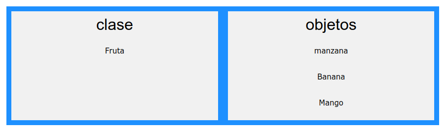

layout: true
class: center, middle, inverse
---

# PHP 7: Conceptos basicos

---
layout: true
class: animated fadeInUp
---
## Agenda

(Tiempo estimado: 2h)

* Introduccion
  - ¿Que es PHP?
  - Instalacion PHP + Apache
  - Herramienta de desarrollo
  - Referencias de consultas
* Sintaxis basica
   - Tipo de datos
   - Variables y Constantes
   - Expresiones y operadores 
   - Estructura de control
   - Array

---
# Agenda

* Bibliotecas de funciones  
   - Funciones de fecha y hora
   - Funcionesd array
   - Funciones de cadena
* POO en Lenguaje PHP
   - Clases y metodos
   - Herencias (extend e interfaz)
* Base de datos.
   - Conexion y selecccionde base de datos
   - Tareas con base de datos.

---

# ¿ Que es PHP ?

.importante[
¡PHP es un lenguaje increíble y popular! <br>
¡Es lo suficientemente potente como para estar en el núcleo del sistema de blogs más grande de la web (WordPress)!<br>
!Es lo suficientemente profundo para ejecutar la red social más grande (Facebook)!<br>
¡También es bastante fácil ser el primer idioma del lado del servidor de un principiante! 
]

* PHP es un acrónimo de "PHP: Preprocesador de hipertexto"
* PHP es un lenguaje de programación de código abierto ampliamente utilizado
* Los scripts PHP se ejecutan en el servidor.
* PHP se puede descargar y usar gratis
* Existen IDE de productores de Software como Zend Studio,
* Delphi for PHP, Eclipse, Visual Code, entre otros

---

# ¿Qué puede hacer PHP?

.texto-mediano[
* PHP puede generar contenido de página dinámico
* PHP puede crear, abrir, leer, escribir, eliminar y cerrar archivos en el servidor
* PHP puede recopilar datos de formularios
* PHP puede enviar y recibir cookies
* PHP puede agregar, eliminar, modificar datos en su base de datos
* PHP se puede utilizar para controlar el acceso de los usuarios
* PHP puede cifrar datos
]

---

# Instalacion Apache, PHP y MariaDB

.texto-mediano[Para poder utilzar PHP en nuestro servidores debemos instalar un servidor `Apache` y el motor `PHP`. 
Existen herramientas que nos dan la facilidad de instalar el paquete PHP, Apache y Mysql (base de datos).]

* Para Windows [XAMMP](https://www.apachefriends.org/index.html)
* Para Linux [LAMP](https://www.apachefriends.org/index.html)

.importante[
   De alguna manera se determina que estas instalaciones no son personalizadas y las configuraciones se tomaran como por defecto y suelen tener una revision extra para su funcionamiento
]

---

#  Herramientas y documentacion

.texto-mediano[* En esta clase se desarrollara mediante el IDE Visual Code que se puede obteneres desde [Visual Code](https://code.visualstudio.com/)
* Para contactar practicas y verificar en linea se puede acceder [W3SCHOOL PHP](https://www.w3schools.com/php/default.asp)
* Se determinara como documentacion oficial al sistio [PHP](https://www.php.net/manual/es/intro-whatis.php)] 

---

# Sintaxis basica

* PHP es sensible a las mayúsculas

```markdown
// ¿Cómo se incrusta en la página web?
<?PHP ... ?>

//recomendado, siempre disponible
<?= expresión ?>
equivale a <? echo expresión ?>
```

* Las instrucciones se separan con un ; como en C. La marca final ?> implica
un ;
* Comentarios: como en C, /* … */ (varias líneas ) y // (una línea)

```markdown
/* Comentario de 
varias líneas */

echo “hola”; // Comentario de una línea
```

---
# Sintaxis basica
.texto-mediano[
* Para imprimir: `echo` y `print`
]

.pull-left[
   ```markdown
   echo: muestra una o más cadenas
   echo cadena1 [, cadena2…];
   echo “Hola mundo”;
   echo “Hola “, “mundo”;
   print: muestra una cadena
   print cadena;
   print “Hola mundo”;
   print “Hola “ . “mundo”;
   ``` 
]

.pull-right[
   ```markdown
   <HTML>
   <HEAD>
      <TITLE>Mi primer programa en PHP</TITLE>
   </HEAD>
   <BODY>
   <?PHP
      print (“<P>Hola mundo</P>”);
   ?>
   </BODY>
   </HTML>
```
]

---

# Sintaxis basica

* Uso de `\n` para generar código HTML legible

.pull-left[
   Codigo PHP
   ```markdown
      print (“<P>Párrafo 1</P>”);
      print (“<P>Párrafo 2</P>”);
   ```   
   
   Codigo HTML

   ```markdown
   <P>Párrafo 1</P><P>Párrafo 2</P>
   ```   
]

.pull-right[
   Salida
   ```markdown
   Párrafo 1

   Párrafo 2   ```
]

---

# Sintaxis básica: inclusion de ficheros

```markdown
include() / include_once()
require() / require_once()
```

* Ambos incluyen y evalúan el fichero especificado
* Diferencia: en caso de error `include()` produce un `warning` y
`require()` un error fatal
* Se usará `require()` si al producirse un error debe interrumpirse
la carga de la página.

---

# Sintaxis básica: inclusion de ficheros

```markdown
<HTML>
<HEAD>
<TITLE>Título</TITLE>
<?PHP
   // Incluir bibliotecas de funciones
   require ("conecta.php");
   require ("fecha.php");
   require ("cadena.php");
   require ("globals.php");
?>
</HEAD>
<BODY>
   <?PHP
      include ("cabecera.html");
   ?>
   // Código HTML + PHP
   . . .
   <?PHP
      include ("pie.html");
   ?>
</BODY>
```
---

# Sintaxis básica: tipos de datos   

* PHP soporta 8 tipos de datos primitivos:
   * Tipos comunes: `boolean`, `integer`, `double`, `string`
   * Tipos compuestos: `array`, `object`
   * Tipos especiales: `resource`, `NULL`

* El tipo de una variable no se suele especificar. Se decide en tiempo de ejecución en función del contexto y puede variar

```markdown
<?php
$var1=10; // integer
$var2="Cadena.."; // string
$var3=true;
$var4=array("valor2",10, 10.5); // array
$var5= new PDO(); // object
$var6=null;
?>

```

---

# Sintaxis básicas: funciones de interes


* La función `gettype()` devuelve el tipo de una variable
* Las funciones is_type comprueban si una variable es de un tipo dado:
`is_array()`, `is_bool()`, `is_float()`, `is_integer()`, `is_null()`, `is_numeric()`,
`is_object()`, `is_resource()`, `is_scalar()`,
`is_string()`
* La función `var_dump()` muestra el tipo y el valor de una variable. Es
especialmente interesante con los arrays
* `isset()` verifica si un variable existe
* `unset()` Destruye una variable
* `settype()` Setea el tipo de una variable
* `empty()` Verifica si una variable esta vacia
* `intval()`, `doubleval()`, `strval()` Convierte el tipo de varible

---

# Sintaxis básicas: tipo integer,  double y boolean

* Tipo integer (números enteros) `–27, -5, 0`

```markdown
<?php
   $entero_baselO = 1234;
   $entero_base8 = 01234;
   $entero_basel6 = 0x1234;
   $entero_negativo = -1234;
?>
```

* Tipo double (números reales) `1.234, -5.33`
* Tipo boolean (lógico) `true, false (insensibles a las mayúsculas)`
   * El 0 y la cadena vacía tienen valor false

---

# Sintaxis básicas: tipo string

* Las cadenas se encierran entre comillas simples o dobles:
* ‘simples’: admite los caracteres de escape \’ (comilla simple) y \\ (barra). Las variables
NO se expanden
* “dobles”: admite más caracteres de escape, como \n, \r, \t, \\, \$, \”. Los nombres de
variables SÍ se expanden

```markdown
<?php
$a = 9;
echo ‘a vale $a\n’;
// muestra a vale $a\n
echo “a vale $a\n”;
// muestra a vale 9 y avanza una línea
echo “”;
// muestra 
echo “”;
// muestra 
```

* Acceso a un carácter de la cadena:
   
```markdown
$inicial = $nombre[0]; 
```
---

# Sintaxis básicas: Ingreso de Variables de Multiples lineas

```markdown
<?php
$formulario = <<<INICIO
<form>
<ínput type="text" name="Nombre" value="Luís Miguel
Cabezas">
<br>
<input type="submit" name="submit" value="Enviar" >
</form>
INICIO;
echo $formulario;
```
---

# Sintaxis básicas: uso de variables

El Nombre del las variables siempre van precedidas de un $
* El nombre es sensible a las mayúsculas
* Debe comenzar por letra o subrayado, seguido de letras, números o
subrayado
* Variables predefinidas:
`$GLOBALS`, `$_SERVER`, `$_GET`, `$_POST`, `$_COOKIES`, `$_FILES`,
`$_ENV`, `$_REQUEST`, `$_SESSION`
```markdown
$valor = 5;
print “El valor es: “ . $valor . “\n”;
print “El valor es: $valor\n”; // ojo: comillas dobles
```

`Resultado: El valor es: 5`

---

# Sintaxis básicas: ambitos de variables
.texto-mediano[
* `Globales`:Toda variable definida dentro de un documento php que no este dentro de una funcion,tambien se pueden llamar con el array $GLOBALS
* `Locales`: Toda funcion definida dentro de una funcion es local a ella
* `Estaticas`: Definidas con la clave static, son variables locales que permanecen luego de cerrada la funcion
* `Parametros`: Es una variable local pasada a la funcion por el procedimiento que la llama. Son locales a la funcion
]

---

# Sintaxis básicas: ejemplo de uso de variables

```markdown
<?PHP
   $mensaje_es="Hola";
   $mensaje_en="Hello";
   $idioma = "es";
   $mensaje = "mensaje_" . $idioma;
   print $$mensaje;
?>
```

---

# Sintaxis básicas: constante

.importante[Las constantes son tipos de datos que no varían en el desarrollo de un programa. En la vida real
existen muchos tipos de constantes, el número pi, la temperatura de congelación del agua, el
nombre de la Empresa, etcétera]

```markdown
define (“CONSTANTE”, “hola”);
print CONSTANTE;
```

* No llevan $ delante
* Sólo se pueden definir constantes de los tipos comunes (boolean, integer,
double, string)
* Funcion defined() – Si existe una constante dada
* Constantes Mágicas (Ej. __LINE__ )
* Constantes Predefinidas (Ej. PHP_VERSION)


---

# Sintaxis básicas: expresiones y operadores 

* Operadores aritméticos `+, -, *, /, %, ++, --`
* Operador de asignación `=`
* Operadores combinados  `.=, +=, etc`
```markdown
$a = 3; $a += 5;  a vale 8
$b = “hola ”; $b .= “mundo”;  b vale “hola mundo”
```
* Equivale a $b = $b . “mundo”;
* Operadores de comparación `==, !=, <, >, <=, >=`
* Operador Ternario `Expresion ? Verdadero : Falso ;`
* Operador de control de error: `@.` Antepuesto a una expresión, evita cualquier
mensaje de error que pueda ser generado por la expresión
* Operadores lógicos `and (&&), or (||), !, xor`
* Operadores de cadena `concatenación: . (punto) asignación con concatenación: .=`
* Precedencia de operadores (de mayor a menor):  `++, -- *, /, % +,- <, <=, >, >= ==, != && || and or`
---

# Sintaxis básicas: Estructuras de control

* Estructuras selectivas:
   * if-else
   * switch
* Estructuras repetitivas:
   * while
   * do …. while
   * for
   * foreach
* Control de Ejecución
   * die
   * exit
---

# Sintaxis básicas: Estructura selectiva if-else

.pull-left[
   ```markdown   
   <?php
      if (condición)
         sentencia

      if (condición)
         sentencia 1
      else
         sentencia 2
   ?>
   ```
]

.pull-right[
   ```markdown 
   <?php
      if (condición1)
         sentencia 1
      else if (condición2)
               sentencia 2
      ...
      else if (condición n)
               sentencia n
      else
      sentencia n+1
   ?>
```
]

<br>
.texto-mediano[
* Mismo comportamiento que en C
* Las sentencias compuestas se encierran entre llaves elseif puede ir todo junto
]

---

# Sintaxis básicas: Estructura selectiva if-else

.pull-left[
```markdown
<?PHP
   if ($sexo == ‘M’)
      $saludo = "Bienvenida, ";
   else
      $saludo = "Bienvenido, ";
      $saludo = $saludo . $nombre;
      print ($saludo);
?>
```
]

.pull-right[
   Salida:
   `Bienvenido, ana`
]

---

# Sintaxis básicas: Estructura selectiva switch


```markdown
   switch (expresión)
   {
      case valor_1:
         sentencia 1;
         break;
      case valor_2:
         sentencia 2;
         break;
      case valor_n:
         sentencia n;
         break;
      default
         sentencia n+1
   }
```

.importante[Mismo comportamiento que en C, sólo que la expresión del case puede
ser integer, float o string]

---

# Sintaxis básicas: Estructura selectiva switch


.pull-left[
   ```markdown
   <?php
   $extension="PDF";
   switch ($extension)
   {
      case ("PDF"):
         $tipo = "Documento Adobe PDF";
         break;
      case ("TXT"):
         $tipo = "Documento de texto";
         break;
      case ("HTML"):
      case ("HTM"):
         $tipo = "Documento HTML";
         break;
      default:
         $tipo = "Archivo " . $extension;
   }
   print ($tipo); 
   ?>
   ```
]

.pull-right[
   Salida:
   `Documento Adobe PDF` 
]


---

# Sintaxis básicas: Estructura repetitiva while y do..while

.pull-left[
```markdown
   while (condición)
   sentencia
```
]

.pull-right[
  ```markdown 
   <?PHP
      print ("<UL>\n");
      $i=1;
      do {
         print ("<LI>Elemento $i</LI>\n");
         $i++;
      } while ($i <= 5)
      print ("</UL>\n");
   ?>
  ```
]


---

# Sintaxis básicas: Ejemplo de estructura repetitiva while:

.pull-left[
```markdown
<?PHP
   print ("<UL>\n");
   $i=1;
      while ($i <= 5)
      {
         print ("<LI>Elemento $i</LI>\n");
         $i++;
      }
   print ("</UL>\n");
?>
```
]

.pull-right[
  ```markdown 
  * Elemento 1
  * Elemento 2
  * Elemento 3
  * Elemento 4
  * Elemento 5
  ```
]


---

# Sintaxis básicas: Estructura repetitiva for

.pull-left[
```markdown
   for (inicialización; condición; incremento)
   sentencia
```
]

.pull-right[
  ```markdown 
  <?PHP
   print ("<UL>\n");
   for ($i=1; $i<=5; $i++)
      print ("<LI>Elemento $i</LI>\n");
      print ("</UL>\n");
   ?>
  ```
]


---

# Sintaxis básicas: Estructura repetitiva for múltiple

.pull-left[
```markdown
<?php
   for ($x = 1 , $y = 1, $z = 1; $y < 10, $z < 10; $x++, $y= $y -2, $z = $z + 3) {
      echo ("$x, $y, $z<br>");
   }
?>
```
]

.pull-right[
  ```markdown 
  ```
]


---

# Sintaxis básicas: Estructura repetitiva foreach

.importante[
   La estructura foreach simplemente da un modo fácil de iterar sobre arrays. foreach funciona solo sobre arrays (y objetos) y resultará en un error al intentar usarlo en una variable con un diferente tipo de datos o una variable no inicializada
]

```markdown
<?php
   $arr = array(1, 2, 3, 4);
   foreach ($arr as &$value) {
      $value = $value * 2;
   }
   // $arr ahora es array(2, 4, 6, 8)
?>
```
---

# Sintaxis básicas: Finalización de la ejecución de un programa

.pull-left[
```markdown
die() y exit()
```
]

---

# Funciones: Estructura


.pull-left[
```markdown 
<?php
   function incrementa (&$a)
   {
      $a = $a + 1;
   }
   $a=1;
   incrementa ($a);
   print $a; // Muestra un 2
?>
```
]


---

# Funciones: Tipo de parametros y alcance de variables.

.pull-left[

* Por defecto los parámetros se pasan por valor
* Paso por referencia

```markdown
<?php
   function suma ($x, $y)
   {
      $s = $x + $y;
      return $s;
   }
   $a=1;
   $b=2;
   $c=suma ($a, $b);
   print $c;
?>
```
]

.pull-right[
   * Los valores de variable dentro de una funcion son locales y dinamicas
   * Si quiero variables estaticas:
   ```markdown 
    <?php
      function contador() {
         static $contador = 0;
         $contador = $contador + 1;
         return $contador;
      }
    ?>  
  ```
]


---

# Funciones: Argumento por defecto


.pull-left[
```markdown
<?php
   function muestranombre ($titulo = "Sr.")
   {
      print "Estimado $titulo:\n";
   }
   muestranombre ();
   muestranombre ("Prof.");
?>
```
]

.pull-right[
  Funciones de manipulación de argumentos:
  ```markdown 
  func_num_args() , func_get_arg() y func_get_args()
  ```
]

---

# Funciones: Argumento por defecto
 
.pull-left[
   Los argumentos con valores por defecto deben ser siempre los últimos:
   ```markdown
   <?php
      function muestranombre ($nombre, $titulo= "Sr.")
      {
         print "Estimado $titulo $nombre:\n";
      }
      muestranombre (“Fernández”);
      muestranombre (“Fernández”, "Prof.");
   ?>
   ```
]

.pull-right[
   Salida:
  ```markdown   
   Estimado Sr. Fernández:
   Estimado Prof. Fernández:
  ```
]


---

# Funciones: Funciones de manipulación de argumentos

.importante[
   func_num_args() , func_get_arg() y func_get_args()
]  

```markdown
<?php
   function capitales() {
      $numero_argumentos = func_num_args();
      $Pais = $numero_argumentos > 0 ? func_get_arg(0) : "España";
      $Capital = $numero_argumentos > 1 ? func_get_arg(1) : "Madrid";
      $habitantes = $numero_argumentos > 2 ? func_get_arg (2) :
      "muchos " ;
      return ("Número de argumentos es: $numero_arguraentos. La capital
      de $Pais es $Capital y tiene $habitantes habitantes.<br>");
   }
   echo capitales();
   echo capitales("Portugal", "Lisboa");
   echo capitales("Francia", "Paris", "muchísimos");
?>
```

---

# Arrays (Tablas) 
 
* Sintaxis:
`array ([clave =>] valor, ...)`
* La clave es una cadena o un entero no negativo. El valor puede ser de cualquier tipo válido en PHP, incluyendo otro array
* Ejemplos:
```markdown
$color = array (‘rojo’=>101, ‘verde’=>51, ‘azul’=>255);
$medidas = array (10, 25, 15);
```
* Acceso:
```markdown
$color[‘rojo’] // No olvidar las comillas
$medidas[0]
```
* El primer elemento es el 0

---

# Arrays (Tablas) : Array Multidimensional
 
```markdown
<?php
   $colores = array( "fuertes" => array ( "rojo" => "FF0000",
   "verde" => "00FF00",
   "azul" => "0000FF"),
   "suaves" => array ( "rosa" => "FE9ABC",
   "amarillo" => "FDF189",
   "malva" => "9A2F68"));
   echo $colores["fuertes"] ["rojo"];
?>
```


---

# Funciones: Biblioteca de funciones
 
Existen muchas bibliotecas de funciones en PHP

* Algunos ejemplos:
* Funciones de manipulación de cadenas
   * Funciones de fecha y hora
   * Funciones de arrays
   * Funciones de ficheros
   * Funciones matemáticas
   * Funciones de bases de datos
   * Funciones de red
   * Algunas bibliotecas requieren la instalación de componentes adicionales
* Todas las funciones de biblioteca están comentadas en la documentación de PHP

---

# Funciones: Funciones de manipulación de cadenas
 
* `explode()`
   * Divide una cadena en subcadenas
   * array explode (string separator, string string [, int limit])
* `rtrim(), ltrim(), trim()`
   * Eliminan caracteres a la derecha, a la izquierda o por ambos lados
de una cadena
* `string rtrim ( string str [, string charlist])`
* `strstr()`
   * Busca la primera ocurrencia de una subcadena
* `strtolower()` / `strtoupper()`
   * Convierte una cadena a minúscula / mayúscula
* `strcmp()` / `strcasecmp()`
   * Compara dos cadenas con/sin distinción de mayúsculas
* `strlen()`
   * Calcula la longitud de una cadena

---

# Funciones: Funciones de fecha y hora
 
* `date()`
   * Formatea una fecha según un formato dado
```markdown
$fecha = date ("j/n/Y H:i");
print ("$fecha");
Resultado:
26/9/2005 17:36
```
* `strtotime()`
   * Convierte una fecha en un timestamp de UNIX
```markdown
$fecha = date ("j/n/Y", strtotime(“5 april 2001"));
print ("$fecha");
Resultado:
5/4/2001
```
---

# Funciones: Funciones de arrays

* `array_count_values()`
   * Calcula la frecuencia de cada uno de los elementos de un array
* array_search()
   * Busca un elemento en un array
* `count()`
   * Cuenta los elementos de un array
* `sort()`, `rsort()`
   * Ordena y reindexa un array (r=decreciente)
* `ksort()`, `krsort()`
   * Ordena por claves un array (r=decreciente)

---

# ¿Qué es POO?

.importante[
   La programación por procedimientos se trata de escribir procedimientos o funciones que realizan operaciones sobre los datos, mientras que la programación orientada a objetos se trata de crear objetos que contienen tanto datos como funciones.
]

La programación orientada a objetos tiene varias ventajas sobre la programación procedimental:

* OOP es más rápido y fácil de ejecutar
* OOP proporciona una estructura clara para los programas
* OOP ayuda a mantener el código PHP SECO "Don't Repeat Yourself" y hace que el código sea más fácil de mantener, modificar y depurar
* La programación orientada a objetos permite crear aplicaciones completamente reutilizables con menos código y un tiempo de desarrollo más corto.

---

## POO: Clase y objeto

* Restringe acceso a la informacion sin permitir cambio
* Soluciona el problema de definicion de la funciones
* Abstrae la programcion a objetos definidos en el diseño
* Optimiza el uso de memoria 
* Se encapsula los `metodos` reflejados en acciones y los elementos del objeto. 

---

## POO: Clase y objeto

Para entender la diferencia veamos la siguiente imagen 



---

## POO: Definicion de clase

 * A continuación, declaramos una clase llamada Fruta que consta de dos propiedades (`$nombre` y `$color`) y dos métodos `set_nombre()` y `get_nombre()` para configurar y obtener la propiedad `$nombre`:

.pull-left[
   ```markdown
   <?php
      class Fruta {
      // el codigo se escribi aca
      }
   ?>
   ```
] 

.pull-right[
   ```markdown
   <?php
   class Fruta {
      // Propiedades 
      public $nombre;
      public $color;

      // Metodos
      function set_nombre($nombre) {
         $this->nombre = $nombre;
      }
      function get_nombre() {
         return $this->nombre;
      }
   }
   ?>
   ```
]  

---

## POO: Definir objetos

```markdown
   <?php
   class Fruta {
      // Propiedades
      public $nombre;
      public $coleor;

      // Metodos
      function set_nombre($nombre) {
         $this->nombre = $nombre;
      }
      function get_nombre() {
         return $this->nombre;
      }
   }

   $manzana = new Fruta();
   $banana = new Fruta();
   $manzana->set_nombre('Manzana');
   $banana->set_nombre('Banana');

   echo $manzana->get_nombre();
   echo "<br>";
   echo $banana->get_nombre();
   ?>
```

---

## POO: La palabra clave `$this`

La palabra clave `$this` se refiere al objeto actual y solo está disponible dentro de los métodos.

```markdown
<?php
   class Fruta {
   public $nombre;
   function set_nombre($name) {
      $this->name = $name;
   }
   }
   $manzana = new Fruta();
   $manzana->set_manzana("Apple");
   echo $manzana->nombre;
?>
``` 

---

## POO: Instanciar un objeto

.importante[Cuando se instancia un objeto se reserva una seccion de memoria donde se declara un limite para acceder a las variables locales y globales.
]

```markdown
<?php
   $apple = new Fruta();
   var_dump($apple instanceof Fruta);
?>
```

---

## POO: Metodo __construct y __destruct

.pull-left[
```markdown
   <?php
      class Fruit {
         public $name;
         public $color;

         function __construct($name) {
            $this->name = $name;
         }
         function get_name() {
            return $this->name;
         }
      }

      $apple = new Fruit("Apple");
      echo $apple->get_name();
   ?>
```
]  

.pull-right[
Se llama a un destructor cuando se destruye el objeto o se detiene o sale del script.
```markdown
<?php
   class Fruit {
      public $name;
      public $color;

      function __construct($name) {
         $this->name = $name;
      }
      function __destruct() {
         echo "The fruit is {$this->name}.";
      }
   }
   $apple = new Fruit("Apple");
?>
```
  ] 

---

## POO: ¿Qué es la herencia?

.importante[
   La herencia significa que se pueden crear nuevas clases partiendo de clases existentes, que tendrá todas los atributos y los métodos de su 'superclase' o 'clase padre' y además se le podrán añadir otros atributos y métodos propios.
] 

* Superclase: Clase de la que desciende o deriva una clase. Las clases hijas (descendientes) heredan (incorporan) automáticamente los atributos y métodos de la la clase padre.

* Subclase: Clase desciendiente de otra. Hereda automáticamente los atributos y métodos de su superclase. Es una especialización de otra clase. Admiten la definición de nuevos atributos y métodos para aumentar la especialización de la clas

* En PHP, a diferencia de otros lenguajes orientados a objetos (C++), una clase sólo puede derivar de una única clase, es decir, PHP no permite herencia múltiple.

---

## POO: ¿Qué es la herencia?

```markdown
<?php
class Fruit {
   public $name;
   public $color;
   public function __construct($name, $color) {
      $this->name = $name;
      $this->color = $color;
   }
   public function intro() {
      echo "The fruit is {$this->name} and the color is {$this->color}.";
   }
}
class Strawberry extends Fruit {
   public function message() {
      echo "Am I a fruit or a berry? ";
   }
}
$strawberry = new Strawberry("Strawberry", "red");
$strawberry->message();
$strawberry->intro();
?>
```
---

## POO: herencia y el modificador de acceso protegido

```markdown
<?php
class Fruit {
public $name;
public $color;
public function __construct($name, $color) {
      $this->name = $name;
      $this->color = $color;
   }
protected function intro() {
      echo "The fruit is {$this->name} and the color is {$this->color}.";
   }
}

class Strawberry extends Fruit {
   public function message() {
      echo "Am I a fruit or a berry? ";
   }
}

// Try to call all three methods from outside class
$strawberry = new Strawberry("Strawberry", "red");  // OK. __construct() is public
$strawberry->message(); // OK. message() is public
$strawberry->intro(); // ERROR. intro() is protected
?>
```

---

## Base de datos: Funciones de bases de datos. 

* mysqli(): Conecta a la base de datos.
* close(): Cierra la conection
* query(): Ejecuta, consulta, insercion y actualziación. Si es una seleccion retorna un objeto tipo `result`
* fetch_assoc() : Seleccionar fila de una seleccion, pertenece al objeto `result`
* num_rows(): Determina la cantidad de registro retornado.

---
class: center, middle, inverse

## Gracias!


