layout: true
class: center, middle, inverse
---

# Conceptos básicos de informática

---
layout: true
class: animated fadeInUp
---
## Agenda

(Tiempo estimado: 1h)

* Breve historia

* Algunas definciones
  * Dato e información
  * Procesamiento de datos
  * Sistema binario
  * Algoritimo
  * Sistema de medidas: almacenamiento, procesamiento y transmision

* Conceptos
  - Hardware, Software
  - Programas
  - Tipo de programas
 - Unidad de medida
---
# Agenda

* Sistemas operativos
  - Historia y definicion
  - Funciones de SO
  - Sistemas operativos existentes
* Virus informaticos
  - Definicion y tipos de virus
  - Antivirus

---

## Breve historia

- Uso de válvulas electrónicas de vacío para procesar información.
- Uso de tarjetas perforadas para ingresar los datos y los programas.
- Tenían un tamaño muy grande, necesitaban gran cantidad de electricidad, producían gran
cantidad de calor y eran muy lentas.
-  Se comenzó a utilizar el sistema binario para representar los datos
-  Se remplazaron los tubos al vació por transistores. 
-  Uso de circuitos integrados (chips) para procesar información.
-  Surge la industria del "software". 
-  Se desarrollan las primeras computadoras personales o PC (microcomputadoras).
-  Ingreso de Internet en el mundo doméstico.
---

## Algunas definiciones

* `Datos`: Los datos son símbolos que representan propiedades o cualidades de elementos o sucesos reales, que pueden ser requeridos en cierto momento como antecedente para la toma de decisiones. 

* `Information`: La información son los datos que son interpretados y representan algo concreto. Es decir, un conjunto ordenado y relacionado de datos que permitirá tomar la decisión con el menor riesgo posible.  

* `Co:mputadora` : La computadora es una herramienta diseñada para realizar cálculos a grandes velocidades, con altos niveles de eficacia y precisión. 

* `Computación`: Es el conjunto de conocimientos científicos y técnicas que permiten el tratamiento automático de la información por medio de computadoras. 

---
# Proceso de información
.pull-center[
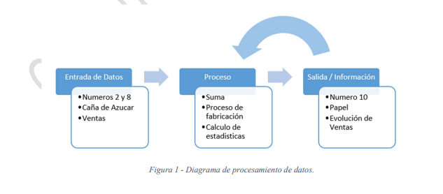
]
---
# Sistema binario

- El sistema binario es un sistema de numeración en el que los números se representan utilizando solamente las cifras cero y uno (0 y 1).

.pull-center[
  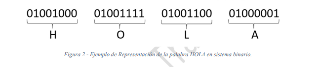]
---
# Algoritmo

* `Algoritmo`: Es un procedimiento que asegura, a partir de una entrada determinada y mediante un número finito de pasos, una salida requerida (o resolución de un problema). 
  

.pull-center[
  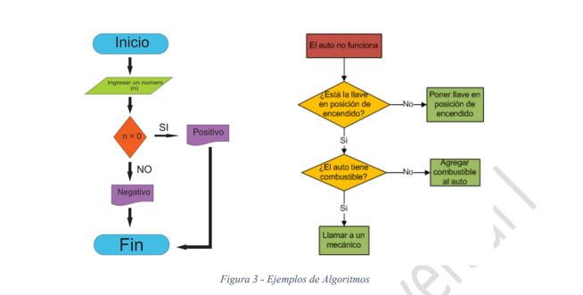
 ] 
---

## Conceptos de software y hardware

- El concepto de hardware se compone de la parte fisica de la computador
- El concepto de Software se compone por la parte intangible
- Los software se diferencia entre aplicaciones y sistemas operativos

.pull-center[
   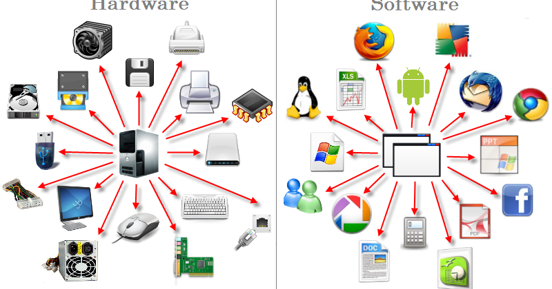

]
---
# Componentes Físicos de una Computadora (Hardware) 

El Hardware de una computadora es la totalidad física, conformada por circuitos electrónicos,
plaquetas que los soportan, cables, mecanismos, discos, teclados, gabinetes, tornillos, pantallas, etc. 

.pull-left[

- Unidad de Control 
- Unidad Aritmética Lógica (ALU) 
- Memoria 

]

.pull-right[

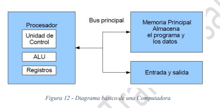

]

---

# Perifericos

Los periféricos son dispositivos externos conectados con una computadora que permiten la comunicación con el ser humano. Permiten la entrada de datos y la salida de información. 

- La clasificación general es:
  -  Periféricos de Entrada: Teclado, Mouse, Micrófono, Scanner, Cámara, etc. 
  - Periféricos de Salida: Impresoras, Parlantes, Monitor, etc. 
  - Periféricos de Entrada/Salida: Lecto-grabadora de DVD, Impresora multifunción (scanner + impresora), 

---
## Concepto de programa

.texto-grande[Los programas son un conjunto de instrucciones que nos permiten resolver problemas mediante la ejecucion lineales en principio] 

.pull-center[
	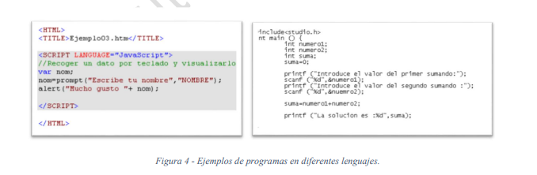
]

---

# Concepto de programa

.center[<iframe width="560" height="315" src="https://www.youtube.com/embed/8CfnPapC0kc" frameborder="0" allow="accelerometer; autoplay; encrypted-media; gyroscope; picture-in-picture" allowfullscreen></iframe>]

---

## Tipo de programas

.pull-center[
   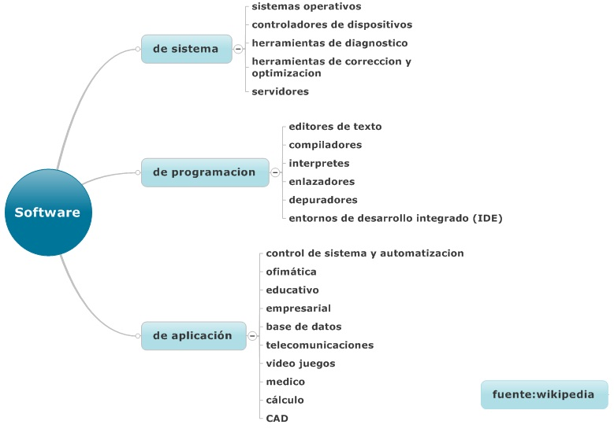
]

---

## Unidad de medida de almacenamiento

Los programas se programan y son escrituras que ocupan su espacio dentro de nuestros dispositivos, esta ocupacion tiene su medida llamda byte, que por su definicion representan a 8 bit (el bit es la unidad minima de almacenamientos). 

.pull-left[
   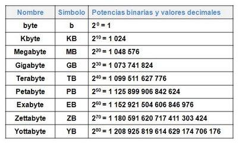
]

.pull-right[
	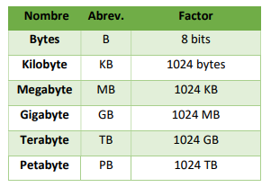
]
---
# Unidad de procesamiento

Con las unidades de procesamiento se mide la velocidad con la que trabaja una computadora. La unidad utilizada son los hercios (hertzio, hertz). 

.pull-center[
	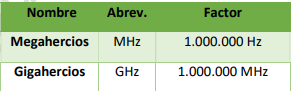
]

---

# Unidad de transmision

También se debe tener en cuenta la velocidad de transmisión de los datos en un período de tiempo, donde se usa como base comúnmente el bit por segundo, o bps. 

.pull-center[
	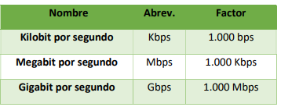
]

---

## Sistemas operativos: Definicion y tipos de sistemas operativos

.texto-grande[Los sistemas operativos son un tipo de software complejo cuya funcionlidad es intervenir entre el hardware y nuestro software de aplicaciones]

.center[<iframe width="560" height="315" src="https://www.youtube.com/embed/fPQCfy6FNE8?start=26" title="YouTube video player" frameborder="0" allow="accelerometer; autoplay; clipboard-write; encrypted-media; gyroscope; picture-in-picture" allowfullscreen></iframe>]

---
## Concepto de archivo y tipo de archivo

.pull-left[
* Definimos Archivo como un conjunto de datos digitales (bits) almacenados en un dispositivo.
* En Windows, los archivos se componen de un nombre y una extensión separados por medio de un
punto: 

    * Texto: **txt, docx, odt**
    * Planillas de Cálculos: **xlsx, ods**
    * Bases de Datos: **mdb, bdf**
    * Presentaciones: **pptx, ppsx**
    * Imágenes: **gif, jpg, svg, bmp, png, psd**
    * Páginas web: **html, mht**
    * Ejecutables: **exe, msi**
]

.pull-right[
   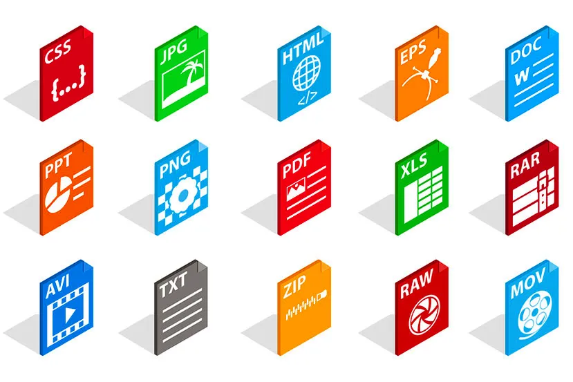
]

---

## ¿Que significa comprimir un archivo? 

.texto-grande[Significa los archivos o carpetas están comprimidos, un procedimiento que se realiza para reducir su peso o su tamaño y así ocupen menos espacio en el disco de tu computador]

---

## Software para comprimir

.texto-grande[Los programas mas conocidos para comprimir archivos son el WinZip, WinRar. 7Zip. Dentro de estas programas se sugiere utilizar en esta catedra la comprension .zip]

.pull-center[
   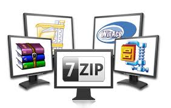
]

---

## Definicion de virus y tipo de virus

.pull-left[
* .texto-mediano[Un virus informático es un programa (software) que puede infectar a otros programas, modificándose de tal manera que causen daño como borrar archivos o afectar el rendimiento y seguridad de las computadoras.]
* .texto-mediano[Pueden dispersarse a través de copias o replicas]
]

.pull-right[
.center[<iframe width="560" height="315" src="https://www.youtube.com/embed/ZHfNaCuVzkg" frameborder="0" allow="accelerometer; autoplay; encrypted-media; gyroscope; picture-in-picture" allowfullscreen></iframe>]
]

---

## Definicion de antirus virus y consejos para una navegacion segura

* Los antivirus son programas que tienen por finalidad detectar y destruir los virus que puedan afectar
al Sistema Operativo de un equipo.
* Algunos de los antivirus que existen en el mercado son: Norton, Symantec, McAfee, Grisoft, Panda,
Avast, AVG, Nod32, etc.

.pull-denter[
.center[<iframe width="560" height="315" src="https://www.youtube.com/embed/gOgHPSphMPE" frameborder="0" allow="accelerometer; autoplay; encrypted-media; gyroscope; picture-in-picture" allowfullscreen></iframe>]
]

---

class: center, middle, inverse

## Gracias!

